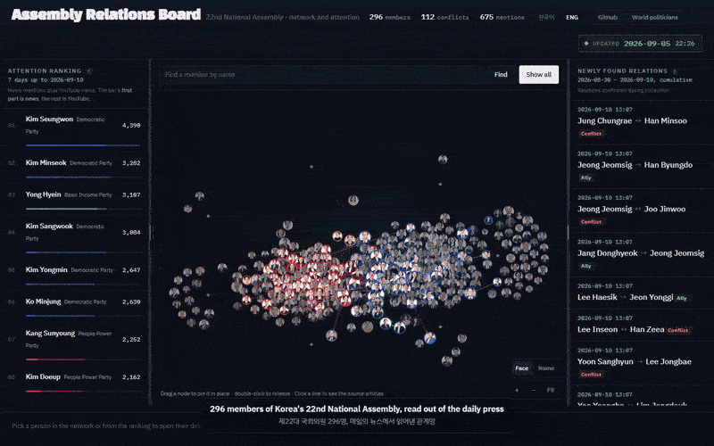
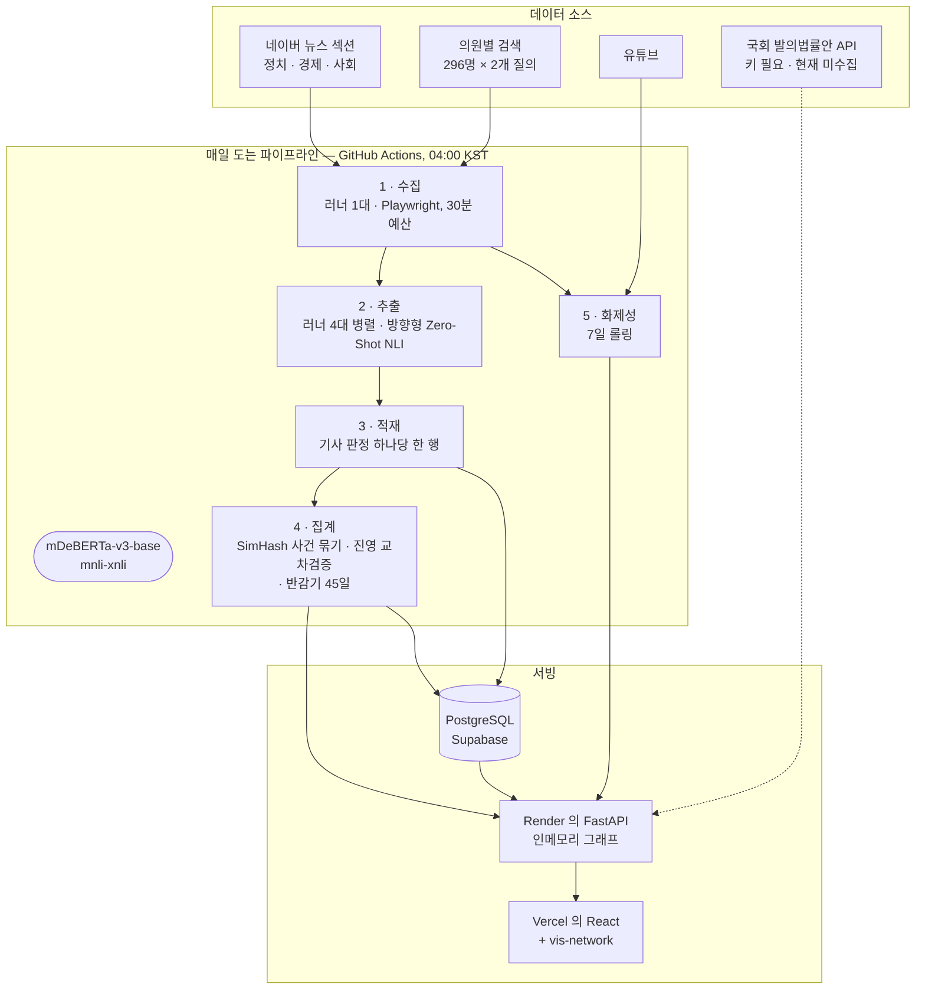

# SYNDEO — 국회 관계 보드

[English](README.md) · **한국어**

**제22대 국회의원 사이의 우호와 갈등을 매일의 한국어 뉴스에서 읽어내고, 모든 관계선이 자기 근거를 내보이는 그래프.**



*배포된 화면에서 찍은 30초: 국회 전체, 화제성 순위, 그리고 대립 하나를 눌러 그 뒤에 있는
기사 12건까지. 한국어와 영어 양쪽으로.*

제22대 국회의원 296명과 정당 8개. 뉴스 본문에서 추론한 관계 엣지 139개 — 갈등 107개,
우호 32개 — 그중 101개가 기사 단위로 열어 볼 수 있는 근거 로그를 달고 있습니다. 매일 도는
GitHub Actions 파이프라인이 네이버 뉴스의 정치·경제·사회 섹션과 의원별 검색을 읽고,
Zero-Shot NLI 모델에게 누가 누구를 비판했고 지지했는지 물어, 그 답을 누적 아카이브에
쌓습니다. 한국어·영어 양쪽을 지원합니다.

*숫자는 `/api/graph/all` 을 2026-09-11 에 확인한 값이고 매일 밤 움직입니다 —
[근거를 직접 확인하려면](#근거를-직접-확인하려면) 에서 직접 다시 뽑을 수 있습니다.
화면 위쪽 머리글은 캔버스가 그리는 수가 아니라 데이터베이스의 행 수를 세기 때문에, 지금은
갈등 엣지를 다섯 개 더 많게 표시합니다.*

### ▶ **[바로 보기](https://korea-politician.vercel.app/)** · [아키텍처](#어떻게-동작하나) · [워크플로우](.github/workflows/crawl.yml) · [소스](https://github.com/showjihyun/KoreaPolitician)

> **[korea-politician.vercel.app](https://korea-politician.vercel.app/)** 에서 돌아갑니다 — 가입 없이, 모바일에서도.

[](LICENSE)


---

### 무엇인가

한국 정치 보도는 따로 떨어진 사건의 흐름으로 도착합니다. SYNDEO 는 그 아래에 있는
*구조* 를 그려 보려는 시도입니다. 관계 엣지 하나하나가 파이프라인이 변호할 수 있는
주장입니다 — 근거 기사가 여기 있고, 근거 문장이 여기 있고, 서로 다른 사건 몇 건에
기대고 있으며, 진영이 다른 매체가 함께 보도했는지까지 함께 나옵니다.

나머지를 전부 결정하는 제약이 하나 있습니다. **근거가 언론 보도이고, 언론 보도는
현실의 중립적인 표본이 아닙니다.** 뉴스 가치 연구가 예측하듯 갈등은 협력보다 훨씬 많이
보도되고, 데이터도 그렇습니다 — 갈등 엣지 107개에 우호 엣지 32개. 다만 파이프라인은
"국회가 원래 갈등투성이다" 와 "갈등이 주로 기사가 된다" 를 가려내지 못합니다. 볼 수 있는
것이 보도뿐이기 때문입니다. 그래서 이 치우침을 세탁하지 않고 드러내는 쪽으로 설계돼
있습니다. 한 진영에서만 보도된 관계는
기사가 몇 건이든 절반 무게의 점선으로 그립니다.

### 화면에 무엇이 있나

보드는 하나의 데이터를 네 칸에 나눠 놓은 것입니다 — 관계망, 화제성 순위, 관계 피드,
그리고 무엇을 누르든 그 아래에서 열리는 상세 패널.

| | |
|---|---|
| **관계망** | 의원 296명과 정당 8개를 vis-network 물리 시뮬레이션으로 그립니다. 의원은 사진 노드이고, 크기는 최근 7일 화제성, 테두리는 소속 정당 색입니다. 정당은 마름모로 그려 제자리에 붙박아 두고 나머지가 그 주위로 모입니다. 시작 위치는 난수가 아니라 정해진 자리에서 출발하므로 같은 데이터는 매번 같은 모양으로 앉습니다. 우호(초록)와 대립(빨강)은 굵고 선명하게, 소속과 공동 언급 — 수로는 그래프의 대부분인 두 층 — 은 배경으로 물려 신호를 덮지 않게 합니다. 아무 관계도 걸리지 않은 의원은 사라지지 않고 흐리게 남습니다. |
| **근거의 질이 선에 드러납니다** | 굵기는 진영 교차 검증을 이미 반영한 무게를 따릅니다. **한 진영에서만 보도된 관계는 점선입니다.** 근거 기록이 아예 없는 옛 관계도 마찬가지입니다. 화살표는 근거가 실제로 방향을 세울 때만 붙고, 아니면 상호 관계로 그립니다. 누르기 전에 선 위에 올려 두면 같은 내용이 요약으로 뜹니다. |
| **선을 누르면 근거가 열립니다** | 아래 패널에 사건 수와 기사 수, 진영별 사건 수, 신뢰도, 관측 기간, 방향, 근거 종류(직접 인용 / 간접 인용 / 기자 서술)가 나오고, 이어서 근거 기사 자체가 펼쳐집니다 — 모델이 읽은 문장, 매체 이름, 그 매체의 진영, 원문 링크. 같은 원문이 여러 곳에 실린 전재는 한 사건으로 묶고 그렇게 밝힙니다. |
| **화제성 순위** | 최근 7일 동안 누가 회자되는지를 뉴스 언급과 유튜브 조회수로 집계하고, 막대를 뉴스 몫과 유튜브 몫으로 갈라 보여 줍니다. 조회수는 로그로 압축해 0~100 척도에 올립니다. 그러지 않으면 바이럴 영상 하나가 한 주치 보도를 눌러 버립니다. |
| **최근 포착된 관계** | 오른쪽 칸에 지난 회차가 새로 확인한 관계가 최신순으로 쌓입니다. 우호·대립 꼬리표가 붙고, 근거가 방향을 가리킬 때만 화살표를 그립니다. 각 줄을 누르면 같은 근거 패널이 열립니다 — 캔버스 위의 선을 누르기 어려운 사람에게는 이 피드가 관계에 닿는 길입니다. |
| **노드 뒤의 사람** | 그래프에서든 순위에서든 인물을 고르면 화제성 / 뉴스 / 유튜브 / 선수가 나오고, 이어서 최근 언급이 매체·조회수·원문 링크와 함께 붙습니다. 그 뒤의 프로필 카드에는 소속 위원회, 사무실, 이메일, 주요 경력과 국회 공식 프로필·홈페이지·위키백과 링크가 들어 있습니다. |
| **나열 기사 할인** | 의원 열 명을 나열한 기사는 각자에 대한 신호가 열 배가 아닙니다. 모든 언급을 `1/√n` 로 나눠 담습니다. 화제성과 관계 근거 양쪽에 똑같이 적용합니다. |
| **두 시간 창을 따로 표시** | 화제성은 7일 롤링, 관계는 수집을 시작한 2026-08-30 부터 누적입니다. 섞으면 화면에 제 합과 안 맞는 숫자가 나가므로, 각 칸에 어느 창인지 밝히는 `?` 를 답니다. |
| **화면은 고쳐 쓰라고 있습니다** | 경계 세 개는 끌어서 조절하고 두 번 누르면 기본값으로 돌아갑니다. 노드는 놓은 자리에 고정되고 두 번 누르면 풀립니다. 칸 너비와 얼굴/이름 선택, 언어는 새로 고쳐도 그대로입니다. 순위와 피드와 경계는 키보드로 닿는 평범한 컨트롤입니다. 캔버스는 그렇지 않고, 그래서 피드가 있습니다. |
| **근거 API 공개** | 인증 없는 읽기 전용 — [근거를 직접 확인하려면](#근거를-직접-확인하려면) 참조. |
| **한국어 · 영어** | UI 전체가 양쪽을 지원합니다 — 의원 이름, 정당, 위원회, 관계 유형, 언론 진영까지. |

### 어떻게 동작하나



**아키텍처:** [그래프·근거 테이블 스키마](docs/GRAPH_STRUCTURE.md) ·
[적용한 알고리즘과 실측값](docs/ALGORITHM_REPORT.md) ·
[그 근거가 된 편향 연구](docs/MEDIA_BIAS_RESEARCH.md)
**워크플로우:** [`.github/workflows/crawl.yml`](.github/workflows/crawl.yml) ·
[실행 이력](https://github.com/showjihyun/KoreaPolitician/actions/workflows/crawl.yml)

매일 밤 실행은 잡 여섯 개입니다. 하나가 기사 목록을 모으고, 넷이 그 목록을 나눠
병렬로 분석하며(러너마다 네 건에 한 건씩, 각자 60분 예산), 하나가 근거를 집계해
공개합니다. 유튜브 화제성과 공동발의 수집은 옆에서 독립된 잡으로 돕니다. 러너
사이에는 JSON 만 오갑니다 — 기사 목록, 그리고 분석 러너마다 건드린 쌍 목록. 분석
러너 하나가 죽어도 마무리 잡은 돌고, 그 러너가 죽기 전까지 저장한 근거는 DB 에서
시각으로 찾아 함께 집계합니다.

짧게 요약하면:

1. **수집** — 네이버 뉴스 섹션 목록 세 곳(정치·경제·사회, 각 5페이지)과 의원당 검색 질의
   두 개. 의원이 둘 이상 나오는 기사만 관계 후보가 됩니다. 수집 단계는 30분 예산을 따로
   갖습니다. 검색 하나가 응답하지 않아도 회차 전체를 먹지 못하게 하기 위해서입니다.
2. **추출** — 한 문장 창을 공유하는 쌍마다 방향형 가설 네 개(*A가 B를 비판*, *B가 A를
   비판*, *A가 B를 지지*, *B가 A를 지지*)를 NLI 모델에 묻고, 정방향과 역방향의 점수 차가
   기준을 넘을 때만 방향을 인정합니다. 그 진술이 누구 입에서 나왔는지도 함께 가릅니다 —
   직접 인용 / 간접 인용 / 기자 서술에 각각 1.0 / 0.7 / 0.3 의 무게를 줍니다.
3. **적재** — 기사 단위 판정을 전부 `edge_observations` 에 남기고 덮어쓰지 않습니다.
   그래프의 엣지는 마지막에 도착한 기사가 아니라 그 전체에서 *유도된* 값입니다.
4. **집계** — 거의 같은 기사들을 SimHash 로 한 사건으로 묶습니다. 통신사 전재는 열 번의
   판단이 아니라 한 번의 편집 판단이 열 번 실린 것이기 때문입니다. 신뢰도는 진영이 다른
   매체가 같은 극성을 보도했을 때만 올라갑니다. 오래된 근거는 반감기 45일로 줄어듭니다.
5. **화제성** — 뉴스 언급과 유튜브 조회수를 같은 0~100 척도로 정규화해 7일 창에서
   합산합니다(유튜브는 정규화 뒤에 채널 권위 배수를 한 번 더 먹기 때문에, 큰 뉴스 채널의
   영상은 100을 넘을 수 있습니다 — 한계 항목을 보십시오).

대표적인 한 회차(2026-09-10): 기사 1,283건 수집, 300건 분석, 246건 저장, 87쌍이 엣지로
승격, 의원 207명에 대해 화제성 933건 기록 — 처음부터 끝까지 33분.

### 뉴스 출처

기사는 **네이버 뉴스** 에서 옵니다. 섹션 목록과 의원별 검색 양쪽을 씁니다. 개별 언론사는
포털이 노출하는 대로이고, 파이프라인은 모든 관측에 언론사명을 기록한 뒤 교차 검증을 위해
정치적 진영에 매핑합니다. 어느 매체를 어느 진영으로 보는지는 [열려 있는
엔드포인트](#근거를-직접-확인하려면)입니다. 코드가 무엇을 가정하는지 짐작하지 말고 직접
확인하고 반박하십시오.

화제성에는 **유튜브** 를 추가로 씁니다. X 와 인스타그램은 꺼 두었습니다. 둘 다 로그인
세션 없이는 수집이 막혔습니다.

의원 프로필과 사진은 국회 공개 의원 정보에서 가져옵니다.

### 가져갈 만한 기법

- **두 글자 한국어 이름은 부분일치가 아니라 경계 검사가 필요합니다.** 현직 의원 중 일곱
  명의 두 글자 이름이 흔한 낱말, 다른 유명인, 그리고 서로의 앞부분과 겹칩니다 —
  김건/김건희, 박정/박정희, 허영/허영심, 황희/황희 정승, 그리고 동료 의원 김윤덕 안에
  들어앉은 김윤. 이 프로젝트가 만들어 낸 최초의 관계가
  `김윤덕 → 김윤` 이었습니다. 관계가 아니라 매칭 아티팩트였습니다. 지금의 매처는 긴
  이름부터 검사하고 매칭 구간을 소비 처리하며, 앞뒤 글자가 한글이면 조사가 아닌 한
  버립니다.
- **대칭 가설이 아니라 방향형 가설을 물으십시오.** 처음에는 두 사람이 "서로 적대적인
  관계인가" 를 물었습니다. *상호* 상태에 대한 주장인데, 한쪽이 다른 쪽을 공격한 문장은
  그 상호 상태를 함의하지 않습니다. 실측: 교과서적인 갈등 문장이 대칭 가설에서 **0.607**
  이 나와 임계값 0.65 를 넘지 못하고 버려졌습니다. 같은 문장을 방향형으로 물으면
  **0.956**, 역방향은 **0.093** 입니다. 대칭 가설은 실제 관계를 놓치면서 *동시에* 누가
  누구에게 무엇을 했는지도 말하지 못했습니다.
- **기사 한 건이 엣지를 소유하게 두지 마십시오.** 기사마다 엣지를 쓰면 그래프에는 마지막에
  처리된 기사가 남습니다. 판정을 전부 기록하고 그 전체에서 엣지를 유도하는 구조여야
  사건 묶기·진영 교차 검증·시간 감쇠가 성립합니다. 전부 집계 연산인데, 그 전에는 집계할
  대상 자체가 없었습니다.
- **한 진영의 물량은 교차 검증이 아닙니다.** 한쪽 언론 스무 건은 하나의 편집 판단이
  증폭된 것입니다. 진영이 다른 매체가 같은 극성을 보도하기 전까지 신뢰도에 상한을 두고,
  그 상한을 화면에서 점선으로 드러냅니다. 2026-09-11 기준 139개 중 실선은 15개뿐인데,
  그게 요점입니다. 불편한 숫자를 돌려줄 수 있어야 쓸모 있는 척도입니다.
- **조용히 도착하는 0 은 예외보다 나쁩니다.** 네이버가 검색 화면을 `sds-comps-*`
  컴포넌트로 갈아엎었습니다. 옛 셀렉터는 아무것도 못 잡았는데, 기다리던 컨테이너는 그대로
  남아 있어서 `wait_for_selector` 는 통과했고 항목 루프가 결과마다
  `if not title_el: continue` 로 다 빠져나갔습니다. 예외도 경고도 없이 의원 296명 검색이
  매일 밤 0건을 돌려주는 동안, 파이프라인은 섹션 크롤링 기사만으로 성공을 보고했습니다.
  몇 주간 그랬습니다. 지금은 몇 건을 건졌는지 세고 0이면 소리 내어 경고합니다.
- **작업 시간은 작업 안에서 재십시오.** 기사 한 건의 비용은 본문 길이와 등장 의원 수에
  따라 달라지므로, 기사 *수* 상한은 *시간* 을 묶지 못합니다. 정기 실행 여섯 회차가
  연속으로 90분 러너 한도에 걸려 죽었습니다. 늘 루프 도중이었고, 엣지 집계와 화제성
  산출은 루프 *뒤* 에 돌기 때문에 그 여섯 밤 모두 기사는 저장하고 아무것도 공개하지
  못했습니다. 데이터베이스는 계속 커지는데 `last_updated` 는 엿새 동안 같은 날짜에 멈춰
  있었습니다. 지금은 파이프라인이 스스로 시계를 보고, 예산이 끝나면 남은 기사를 버리고,
  마무리 단계에는 반드시 도달합니다.
- **항목 사이에서만 보는 예산은 예산이 아닙니다.** 위의 시계가 루프 도중에 죽던 회차를
  살렸는데, 2026-09-13 회차가 또 죽었습니다. 뉴스 스텝이 110분 한도에 걸렸고 집계는
  실행되지 못했습니다. 예산을 보는 자리가 딱 두 곳이었습니다. 워커가 기사를 집어들 때,
  그리고 끝난 기사 사이. 비싼 작업이 기사 **안쪽** 에 있으면 둘 다 아무 일도 하지
  못합니다. `Future.cancel()` 은 아직 시작하지 않은 것만 취소하므로, 300건이 이미 전부
  워커에 들어간 상태에서는 하나도 취소하지 못한 채 "남은 기사 **0건**" 이라고 적었습니다.
  그 사이 칼럼 기사 한 건이 — 정치인 열 몇 명이 반복해 등장하고, 함께 나오는 창마다
  NLI 를 4회 부르는 — 로그 한 줄 없이 워커를 열 분 붙잡고 있었고, `as_completed` 와
  `with` 블록은 그것을 충실히 기다렸습니다. 지금은 예산을 **쌍 사이** 에서 보고, 쌍
  하나에 채점할 창을 8개로 묶고(어차피 상위 3개만 평균합니다 — 실측으로 그런 쌍 하나가
  NLI 120회에서 32회로), 남은 워커는 정해진 유예만큼만 기다린 뒤 두고 가며 그때까지의
  결과를 공개합니다.
- **실제로 돌리는 길이로 재십시오.** 느린 밤을 추적하면서 로컬에서 재 본 NLI 한 번은
  17ms 였고, 그 숫자 때문에 느려진 원인을 러너 고장으로 보게 됐습니다. 그런데 그건
  40토큰짜리 문장으로 잰 값이었습니다. 파이프라인이 실제로 채점하는 창은 약 230토큰이고,
  거기서는 코어 하나로 **608ms** 입니다. 35배이고, 쌍당 30~80초를 정확히 설명하는
  값입니다. 다른 두 용의자 — 스레드가 코어를 넘치게 쓰는 것, 느린 파이썬 토크나이저 —
  도 각각 재서 뺐고, 워크플로에 새로 남긴 하드웨어 줄은 느렸던 두 밤이 모두 AVX-512 를
  갖춘 EPYC 기계였다는 걸 보여 줬습니다. 고장 난 것은 없었습니다. 일이 러너 한 대의
  몫을 넘었고, 그래서 이제 네 대에서 돕니다.
- **`vercel.json` 에는 주석을 넣을 수 없고, 그 실패는 눈에 띄지 않습니다.** JSON 에 주석이
  없으니 `"//"` 키를 쓰는 관습이 있는데, Vercel 은 이를 스키마 검증에서 거부합니다.
  *빌드가 시작되기 전에* 말입니다. 그래서 rewrite 수정과 CSP 헤더를 담은 커밋이 한 번도
  배포되지 못했고, 사이트는 아흐레 동안 이전 빌드로 돌았습니다. 그 커밋이 고친 버그를
  그대로 켠 채로. 닫히면서 실패하는 설정은 괜찮지만, 알려 주기 전에 실패하는 설정은
  괜찮지 않습니다.
- **포털 기사 본문은 직접 파싱하십시오.** `newspaper3k` 의 일반 추출 규칙은 네이버
  마크업에서 보일러플레이트 83자를 돌려줬습니다. 정치 섹션 기사 10건으로 실측했더니
  150자 기준을 1건만 통과했고, 전용 셀렉터 체인은 10건 전부 통과했습니다(530~2,033자).
  이것 때문에 후보 기사 54건 중 3건만 저장되고 있었습니다.

### 시작하기

**준비물:** Docker 와 Docker Compose(API·데이터베이스), Node.js 18+(프론트엔드),
Python 3.12(파이프라인을 로컬에서 돌릴 때).

```bash
docker-compose up -d          # API :5000, PostgreSQL 호스트 :25432
```

- API 문서: http://localhost:5000/docs
- 최초 기동 시 `data/assembly_members_complete.json` 에서 의원 296명을 적재합니다.
- `docker-compose.yml` 에는 `legacy` 프로필 뒤에 Neo4j 서비스가 남아 있습니다.
  파이프라인은 쓰지 않습니다. 그래프는 PostgreSQL 에 있습니다.

프론트엔드는 **비공개** 저장소에 따로 있어, 보드의 소스는 공개돼 있지 않습니다. 아래 모든
것 — API, 파이프라인, 근거 엔드포인트 — 은 프론트엔드 없이 돕니다.

수집은 GitHub Actions 가 매일 돌립니다. 로컬에서 돌리려면 단계를 **개별로** 실행하십시오.
`backend/scripts/run_news_sns.py` 는 `while True` 데몬이라 일회성 실행에 맞지 않습니다.

```bash
export PYTHONPATH=backend
export POSTGRES_HOST=localhost POSTGRES_PORT=25432 \
       POSTGRES_USER=postgres POSTGRES_PASSWORD=1234 POSTGRES_DB=postgres
export API_BASE_URL=http://localhost:5000 API_WRITE_TOKEN=<토큰>

python backend/crawlers/news_crawler_pipeline.py   # 뉴스 수집 + 관계 집계
python backend/crawlers/sns_crawler_pipeline.py    # 유튜브 화제성
```

뉴스 파이프라인은 인자 없이 부르면 한 프로세스에서 모든 단계를 돕니다. Actions 는 같은
단계를 러너 여러 대로 나눠 돌리고, 로컬에서도 똑같이 할 수 있습니다.

```bash
python backend/crawlers/news_crawler_pipeline.py collect --out articles.json
python backend/crawlers/news_crawler_pipeline.py analyze --articles articles.json \
       --shard 0 --shards 4 --out pairs/pairs-0.json        # 샤드마다 하나씩
python backend/crawlers/news_crawler_pipeline.py finish --pairs-dir pairs --shards 4
```

관계 추출 모델(약 550MB)을 처음 한 번 내려받습니다. Windows PowerShell 에서는
`$env:PYTHONPATH="backend"` 형태로 지정합니다.

```bash
pip install -r backend/requirements-api.txt \
            -r backend/requirements-crawler.txt \
            -r backend/requirements-dev.txt
pytest                        # 154개
```

저장소 루트의 `pytest.ini` 가 경로와 `PYTHONPATH` 를 잡아 주므로 `pytest` 만 쳐도 돕니다.
테스트만 돌릴 때도 크롤러 requirements 가 필요합니다. 테스트 모듈 네 개가 `requests`,
`playwright`, `bs4` 를 모듈 수준에서 임포트하기 때문입니다.

순수 함수(문장 분리, SimHash, 신뢰도, 진영 매핑, 공동발의 집계)는 DB 없이 돌고, 적재·집계
·API 테스트는 실제 PostgreSQL 을 씁니다. 접속할 수 없으면 자동으로 건너뜁니다. 개발자의
데이터를 건드리지 않도록 전용 테스트 DB 를 따로 만듭니다.

조율값은 전부 환경변수이고, 기본값의 근거는 각 상수 옆에 적어 두었습니다.

| 환경변수 | 기본값 | 무엇을 바꾸나 |
| :--- | :--- | :--- |
| `RELATION_HALF_LIFE_DAYS` | 45 | 최근 논조의 반감기 |
| `RELATION_SIMHASH_DISTANCE` | 6 | 같은 사건으로 묶을 본문 유사도 |
| `RELATION_CLUSTER_WINDOW_DAYS` | 1 | 며칠까지 떨어진 기사를 한 사건으로 볼지 |
| `RELATION_CAMP_RELIABILITY` | 0.7 | 진영 하나가 도달할 수 있는 신뢰 상한 |
| `RELATION_MIN_CLUSTERS` | 1 | 엣지로 승격하는 최소 사건 수 |
| `RELATION_NLI_THRESHOLD` | 0.65 | 함의 확률 하한 |
| `RELATION_DIRECTION_MARGIN` | 0.10 | 방향을 인정할 점수 차 |
| `RELATION_WINDOW_RADIUS` | 1 | 언급 앞뒤로 함께 읽을 문장 수 |
| `RELATION_MAX_WINDOWS_PER_PAIR` | 8 | 쌍 하나에서 점수를 매길 창의 최대 개수 |
| `RELATION_MAX_NAMES_PER_ARTICLE` | 12 | 기사 한 건에서 쌍을 만들 이름의 최대 개수 |
| `RELATION_DROP_NARRATION` | 꺼짐 | 켜면 기자 서술을 엣지에서 아예 뺍니다 |
| `NEWS_TIME_BUDGET_SEC` | 5400 | 한 회차가 마무리 전까지 자신에게 주는 시간 (Actions 분석 러너는 각 3600) |
| `NEWS_COLLECT_BUDGET_SEC` | 1800 | 그중 수집 단계가 쓸 수 있는 몫 |
| `NEWS_FINISH_GRACE_SEC` | 60 | 기사를 붙잡고 있는 워커를 기다려 주는 시간 |
| `NEWS_MAX_ARTICLES` | 300 | 한 회차가 분석할 기사 수 |

운영 스크립트:

```bash
# 근거 분포 확인 (사건 수, 진영 커버리지, 신뢰도, 전재 비율, 진영표 미등재 매체)
python backend/scripts/evidence_report.py

# 집계 이전에 만들어진 엣지를 근거 로그로 옮긴다. 먼저 계획만 본다.
python backend/scripts/backfill_edge_observations.py --dry-run
python backend/scripts/backfill_edge_observations.py --push

# 사람이 검증할 표본 뽑기 → 두 사람이 채운 뒤 채점
python backend/scripts/coding_sample.py sample -n 200
python backend/scripts/coding_sample.py score

# 맨 위 데모를 배포된 화면에서 다시 찍는다 (Playwright + ffmpeg + gifsicle)
python scripts/record_demo.py
```

### 근거를 직접 확인하려면

**화면에서:** 관계선을 누르면 아래 패널에 사건 수, 진영별 사건 수와 신뢰도가 나오고,
이어서 근거 기사 목록이 원문 링크와 함께 펼쳐집니다.

**API 로** (인증 없는 읽기 전용):

```bash
# 관계 하나의 근거 전체 — 집계 결과, 기사 목록, 사건 묶음
# 이 쌍은 2026-09-11 기준 세 진영 모두에서 사건 12건이 잡혀 있습니다.
curl "https://korea-politician-api.onrender.com/api/relations/evidence?a=김민석&b=정청래"

# 근거 원본 덤프 (페이지 단위)
curl "https://korea-politician-api.onrender.com/api/relations/evidence?limit=200"

# 언론사를 어느 진영으로 보고 있는지
curl "https://korea-politician-api.onrender.com/api/relations/camps"

# 지금 그려지는 것 전부 — 이 문서의 모든 숫자가 나온 곳
curl "https://korea-politician-api.onrender.com/api/graph/all"
```

근거 기록이 없는 쌍은 빈 집계 대신 그렇게 적힌 404 를 돌려줍니다.

### 이 데이터의 한계

- **사람이 검증한 표본이 아직 없고, 이것이 가장 큰 한계입니다.** 정밀도·재현율 수치가
  나오기 전까지 관계 데이터는 결과가 아니라 방법의 예시로 보아야 합니다. 표본 추출과 채점
  스크립트(`coding_sample.py`)는 있고, 코딩 작업은 아직입니다.
- **대부분의 엣지는 이 방법이 내세우는 기준을 아직 넘지 못했습니다.** 2026-09-11 기준
  관계 엣지 139개 중 **진영 교차로 확인된 것은 15개**, 86개는 한 진영 보도에만 기대고
  있으며, **38개는 근거 기록 자체가 없습니다** — 근거 테이블이 생기기 전에 만들어져
  `backfill_edge_observations.py` 를 기다리는 것들이고, 그중 둘은 기사가 없는 예시
  데이터입니다. 별개로 **65개는 사건 하나에만 기대고 있습니다.** 아카이브가 아직 어려
  `RELATION_MIN_CLUSTERS` 가 1이기 때문입니다. 화면은 이것들을 모두 점선으로 그리지만,
  정직한 요약은 진영 교차 검증이 낮은 숫자를 보고하고 있는 작동 중인 장치라는 것입니다.
- **아카이브가 11일치입니다.** "누적" 은 2026-08-30 부터라는 뜻입니다. 시간 감쇠, 사건
  묶기, 진영 교차 확인은 모두 더 긴 기간이 쌓여야 의미를 갖습니다.
- **여기 있는 것은 *보도된* 관계입니다.** 언론이 다루지 않은 협력과 갈등은 없습니다. 갈등
  107 대 우호 32 이라는 비율은 최소한 부분적으로는 국회가 아니라 뉴스 선택에 대한
  사실입니다.
- **화제성은 영향력이 아닙니다.** 얼마나 많이 쓰이는지를 잽니다. 조용히 중요한 일을 하는
  의원은 정확하게, 그리고 쓸모없게 낮은 점수를 받습니다. 유튜브 점수는 정규화 뒤에 채널
  권위 배수를 한 번 더 먹기 때문에 큰 뉴스 채널의 영상 하나가 뉴스 언급의 상한을 몇 배로
  넘길 수 있습니다. 0~100 이라는 공통 척도가 시사하는 것만큼 두 신호가 서로 견줄 만하지
  않습니다.
- **모든 것의 위에 포털 한 곳이 있습니다.** 언론사 진영은 통제하지만, 포털이 무엇을
  노출할지 고르는 편집 선택은 통제하지 못합니다.
- **한 회차는 수집한 약 1,300건 중 300건을 분석합니다.** 상한이 회차를 유한하게 만들고,
  나머지는 다음 밤으로 넘어갑니다. 커버리지는 수집분 전체가 아니라 그 표본입니다.
- **명부는 300석 중 296명입니다.** 원본 데이터가 그렇게 담고 있고, 그 차이는 여기서
  맞추지 않았습니다.
- **검색은 한글 이름만 받습니다.** 검색창은 `/api/graph/{이름}` 에 그대로 넘어가고 그쪽은
  한글 이름으로 찾습니다. 영어 화면에서도 `Kim Minseok` 이 아니라 `김민석` 이어야 하고,
  영문 이름을 넣으면 철자를 알려 주는 대신 "찾지 못했습니다" 로 돌아옵니다.
- **첫 방문은 잠든 서버를 기다립니다.** API 가 무료 인스턴스라 15분 놀면 잠들고, 깨우는 데
  1분쯤 걸립니다. 화면이 지금 무엇을 기다리는지 말하고 경과 초를 세지만, 그래도 1분입니다.
- **NLI 모델은 기사 전체가 아니라 문장 창을 읽고, 가끔 틀립니다.** 극성은 신호이지 판정이
  아닙니다.
- **아직 만들지 않은 보정:** 언론사별 논조 기준선, 부정성 선택 편향 역가중, 클릭베이트
  할인. 셋 다 보정값을 잡으려면 근거가 더 쌓여야 합니다.

> 보정의 근거가 된 논문은 [MEDIA_BIAS_RESEARCH.md](docs/MEDIA_BIAS_RESEARCH.md) 에,
> 실제로 적용한 내역과 실측값은 [ALGORITHM_REPORT.md](docs/ALGORITHM_REPORT.md) 에 있습니다.

### 배포

전부 무료 티어입니다.

- **API** — Render. `render.yaml` 과 레포의 `Dockerfile` 을 씁니다. 헬스 체크는 `/health`.
  무료 인스턴스는 15분 무트래픽이면 잠들기 때문에, 파이프라인이 쓰기 직전과 집계된 엣지를
  공개하기 직전에 각각 깨웁니다.
- **데이터베이스** — Supabase PostgreSQL. 직결이 아니라 Supavisor 트랜잭션 풀러(6543번
  포트)를 경유합니다. 무료 티어의 커넥션 한도가 낮고 크롤러는 요청마다 풀에서 빌려 쓰기
  때문입니다.
- **파이프라인** — GitHub Actions, 매일 04:00 KST. 공개 저장소라 러너 사용량이 무료입니다.
  뉴스 분석은 vCPU 4개짜리 러너 네 대로 나눠 돌고, 모델은 회차 사이에 캐시해 러너
  네 대가 허깅페이스에서 550MB 를 각자 받지 않게 합니다.
- **프론트엔드** — Vercel.

구성 가이드: [docs/BACKEND_DEPLOY.md](docs/BACKEND_DEPLOY.md).

### 앞으로

- **공동발의 엣지.** 뉴스는 갈등을 싣고 협력을 뺍니다. 그래서 협력의 근거는 뉴스 밖에서
  가져와야 합니다. 법안 공동발의는 추론이 아니라 직접 측정입니다. 파이프라인 단계는 이미
  있고 돌기도 하지만, 수집을 시작하려면 `ASSEMBLY_API_KEY` 가 필요합니다.
  [MEDIA_BIAS_RESEARCH.md](docs/MEDIA_BIAS_RESEARCH.md) 의 알고리즘 3입니다.
- **사람이 코딩한 검증 세트.** 이것이 이 프로젝트를 시연에서 오차율이 측정된 무언가로
  바꿔 줍니다.
- **DCP 는 우호를 잴 수 있을 때까지 꺼 둡니다.** 초기 설계 논문이 제안한 Dynamic
  Contextual Propagation 은 동맹을 *같은 정당* 으로 정의했습니다. 정파 구조를 보정하는 게
  아니라 증폭하는 셈입니다. 게다가 운영 환경에서는 맥락을 `localhost` 에서 받아 오려다
  조용히 입력을 그대로 돌려주고 있었습니다. 파이프라인에서는 뺐지만
  `core/dcp_algorithm.py` 는 남겨 둡니다. 공동발의가 진짜 우호 신호를 대 주면 그때
  다시 켤 출발점입니다.

### 관계가 틀렸다면

충분히 그럴 수 있습니다 — 위의 한계를 보십시오. 근거 엔드포인트를 열어 둔 이유가 바로
추출 결과를 기사 단위로 확인하고 반박할 수 있게 하기 위해서입니다. 두 사람의 이름, 지금
그 엣지가 주장하는 내용, 그리고 그것과 어긋나는 기사를 담아 이슈를 열어 주십시오.

### 문서

| 문서 | 무엇이 들어 있나 |
| :--- | :--- |
| [MEDIA_BIAS_RESEARCH.md](docs/MEDIA_BIAS_RESEARCH.md) | 언론 편향 연구 정리와, 거기서 끌어낸 보정 설계 |
| [ALGORITHM_REPORT.md](docs/ALGORITHM_REPORT.md) | 실제로 적용한 내역과 실측값 |
| [GRAPH_STRUCTURE.md](docs/GRAPH_STRUCTURE.md) | 노드·엣지 스키마와 근거 로그 테이블 |
| [BACKEND_DEPLOY.md](docs/BACKEND_DEPLOY.md) | 무료 티어 배포 가이드 |
| [reddit_post.md](docs/reddit_post.md) | 편향 작업을 촉발한 r/politicalscience 방법론 지적 |
| [DCP_paper.txt](docs/DCP_paper.txt) · [영문](docs/DCP_paper_en.txt) | 초기 Dynamic Contextual Propagation 설계. 기록으로 남깁니다 |

### 기술 스택

Python 3.12 · FastAPI · psycopg 3 · PostgreSQL · Playwright · BeautifulSoup ·
transformers + PyTorch (`MoritzLaurer/mDeBERTa-v3-base-mnli-xnli`) ·
React 19 · Vite 6 · vis-network · GitHub Actions · Render · Vercel · Docker Compose

### 라이선스

MIT — [LICENSE](LICENSE) 참조. 데이터 출처: 국회 공개 의원 정보, 네이버 뉴스, 유튜브.

---

## 관련 프로젝트

- **[showjihyun/world-politicians](https://github.com/showjihyun/world-politicians)** — 같은 아이디어를 미국 정치에 적용한 것.

*Created by Choi Ji Hyun for Advanced Political Data Science Lab.*
