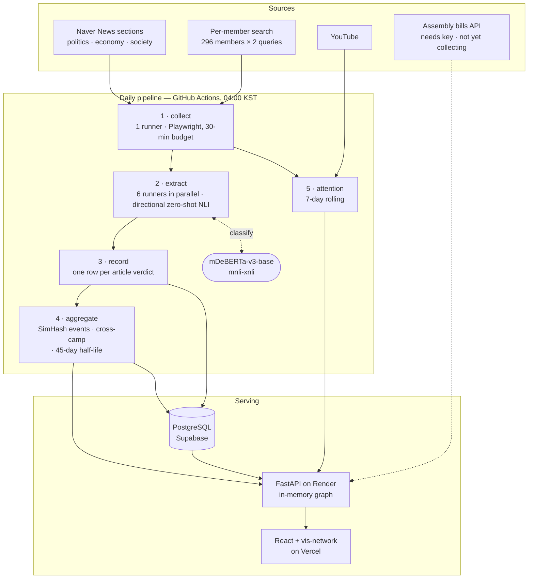

# SYNDEO — Korean National Assembly Relationship Board

**English** · [한국어](README.ko.md)

**An interactive graph of which members of Korea's National Assembly are backing whom and feuding with whom — read out of the daily Korean press, with every edge showing what it rests on.**


*Thirty seconds on the live board: the whole Assembly, the attention ranking, then one
conflict opened down to the twelve articles behind it, in Korean and English.*

296 members of the 22nd National Assembly and 8 parties. 139 relationship edges
inferred from news text — 107 conflicts, 32 alliances — of which 101 carry an evidence
log you can open article by article. A daily GitHub Actions pipeline reads the politics,
economy and society sections of Naver News plus a per-member search, asks a zero-shot
NLI model who criticised or defended whom, and folds the answer into a running archive.
Bilingual (한국어 / English).

*Counts are from `/api/graph/all`, checked 2026-09-11, and move every night — see
[Inspecting the evidence](#inspecting-the-evidence) to re-derive them. The board's own
header counts rows in the database instead, and currently reads five conflict edges
higher than the canvas draws.*

### ▶ **[Try it live](https://korea-politician.vercel.app/)** · [Architecture](#how-it-works) · [Workflow](.github/workflows/crawl.yml) · [Source](https://github.com/showjihyun/KoreaPolitician)

[](LICENSE)


---

### What it is

Korean political coverage arrives as a stream of separate incidents. SYNDEO tries to
render the *structure* under it: a force-directed graph where a relationship edge is a
claim the pipeline can defend — here are the articles, here is the sentence, here is how
many distinct events it rests on and whether outlets from opposing camps reported it.

The design constraint that shapes everything else: **the evidence is press coverage, and
press coverage is not a neutral sample of reality.** News-value research predicts that
conflict is reported far more than cooperation, and the pipeline's output is consistent
with that — 107 conflict edges against 32 alliance edges — though the pipeline cannot
distinguish "the Assembly is mostly conflict" from "conflict is mostly what gets
printed," because press coverage is the only thing it can see. So it is built to expose
the skew rather than launder it: a relationship only one camp reported stays dashed at
half weight, no matter how many articles back it.

### What's on screen

The board is four panes over one dataset — a graph, a ranking, a feed, and a drawer that
opens underneath whichever of them you click.

| | |
|---|---|
| **The graph** | 296 members and 8 parties in a vis-network physics simulation. A member is a photo node sized by their 7-day attention score and ringed in their party's colour; parties are diamonds, pinned in place as the anchors everyone else settles around. Starting positions are seeded rather than random, so the same data lands in the same shape on every load. Alliance (green) and conflict (red) are drawn boldly; party membership and co-mention — the two structural layers, and by count the bulk of the graph — recede into the background so they don't drown the signal. Members no relationship has touched stay dim rather than vanish. |
| **Evidence quality is visible in the line** | Thickness follows a weight that already accounts for cross-camp verification. **A relationship reported by only one camp is dashed**, as is one carrying no evidence log at all. An arrowhead appears only when the evidence establishes direction; otherwise the edge is drawn as mutual. Hovering summarises all of it before you commit to a click. |
| **Click a line, see what it rests on** | The drawer fills with event count and article count, per-camp event counts, confidence, observation window, direction, and evidence type (direct quote / indirect quote / reporter narration) — then the source articles themselves: the sentence the model read, the outlet, the camp that outlet is mapped to, and a link to the original. Copies of one wire story are grouped into a single event and labelled as such. |
| **Attention ranking** | Who is being talked about over the last 7 days, from news mentions and YouTube view counts, each bar split into its news and its YouTube half. View counts are log-compressed onto a 0–100 scale, because raw counts made one viral video outweigh a week of coverage. |
| **Newly found relations** | The right rail lists what the last run added, newest first, each row tagged ally or conflict and drawn with an arrow only where the evidence gave one. Every row opens the same evidence drawer — which is also how the relationship lines stay reachable for anyone who can't click a line on a canvas. |
| **The person behind the node** | Picking someone — in the graph or from the ranking — opens attention / news / YouTube / terms, then their recent mentions with outlet, view count and a link to each. The profile card behind that carries committees, office, email, career, and links to the Assembly profile, homepage and Wikipedia. |
| **Article focus weighting** | A piece listing ten members is not ten times the signal about each. Every mention is discounted by `1/√n`, for attention scoring and relationship evidence alike. |
| **Two time windows, stated separately** | Attention is a 7-day rolling window; relationships are cumulative since collection began on 2026-08-30. Mixing them silently would put numbers on screen that don't add up, so each rail carries a "?" that says which window it is on. Every date on the board is Korea Standard Time, including the day a nightly run stamps its data with. |
| **A board you can rearrange** | The three dividers drag and reset on a double-click, nodes pin where you drop them and release on a double-click, and the pane widths, the face-or-name choice and the language all survive a reload. The ranking, the feed and the dividers are ordinary keyboard-reachable controls; the canvas is not, which is why the feed exists. |
| **Open evidence API** | Read-only, no auth — see [Inspecting the evidence](#inspecting-the-evidence). |
| **Bilingual** | Korean and English throughout — member names, parties, committees, relationship types, press camps. |

### How it works



**Architecture:** [Graph and evidence-table schema](docs/GRAPH_STRUCTURE.md) ·
[Algorithms applied, with measurements](docs/ALGORITHM_REPORT.md) ·
[The bias literature behind them](docs/MEDIA_BIAS_RESEARCH.md) — *all three in Korean.*
**Workflow:** [`.github/workflows/crawl.yml`](.github/workflows/crawl.yml) ·
[run history](https://github.com/showjihyun/KoreaPolitician/actions/workflows/crawl.yml)

The nightly news run is eight jobs. One collects the article list; six analyse it in
parallel, each taking every sixth article on its own 60-minute budget; one aggregates the
evidence and publishes. YouTube attention and bill co-sponsorship run alongside as independent
jobs. The runners pass nothing but JSON between them — the article list, and each
analyser's list of the pairs it touched — and if an analyser dies, the finishing job still
runs and recovers the evidence that runner had already saved, from the database, by
timestamp.

The short version:

1. **Collect** — three Naver News section listings (politics, economy and society, five
   pages each) plus two search queries per member. Only articles naming two or more
   members become relationship candidates. Collection has its own 30-minute budget so a
   hung search can't eat the whole run.
2. **Extract** — for each pair sharing a sentence window, the analyzer asks a zero-shot
   NLI model four directional hypotheses (*A criticised B*, *B criticised A*, *A backed
   B*, *B backed A*) and keeps a direction only when forward and reverse scores differ by
   a margin. It also classifies whose statement it was — direct quote, indirect quote, or
   reporter narration — and weights them 1.0 / 0.7 / 0.3.
3. **Record** — every article-level verdict is written to `edge_observations` and never
   overwritten. The graph edge is a *derived* value, not the last article to arrive.
4. **Aggregate** — near-duplicate articles are clustered into single events by SimHash,
   because wire syndication is one editorial decision reprinted, not ten. Confidence
   rises only when outlets from opposing camps report the same polarity. Older evidence
   decays on a 45-day half-life.
5. **Attention** — news mentions and YouTube views are normalised onto a 0–100 scale and
   summed over a 7-day window (YouTube then takes a channel-authority multiplier on top,
   so a large news channel's video can exceed 100 — see the caveats).

A recent run (2026-09-10, the first to complete after the time-budget fix below): 1,283
articles collected, 300 analysed, 246 stored, 87 pairs promoted to edges, 933 attention
records across 207 members — 33 minutes end to end.

### News sources

Articles come from **Naver News**, both the section listings and per-member search.
Individual outlets are whatever the portal surfaces; the pipeline records the outlet name
on every observation and maps it to a political camp for cross-verification. Which outlet
sits in which camp is served by `/api/relations/camps` — argue with the mapping directly
rather than guessing what the code assumes.

Attention data additionally uses **YouTube**. X and Instagram are switched off: both have
closed off collection without a login session.

Member profiles and portraits come from the National Assembly's public member data.

### Techniques worth stealing

- **Korean two-syllable names need boundary checks, not substring matching.** Seven
  sitting members have two-syllable names that are prefixes of common words, of other
  public figures, and of each other: 김건/김건희, 박정/박정희, 허영/허영심, 황희/황희 정승,
  and 김윤 sitting inside fellow member 김윤덕. The *only* relationship the first crawl
  ever produced was `김윤덕 → 김윤` — not a relationship, a matching artifact. The matcher
  now tries longer names first, marks matched spans as consumed, and rejects a hit whose
  neighbouring character is Hangul unless it is a particle.
- **Ask directional hypotheses, not symmetric ones.** The original prompt asked whether
  two people "are in a hostile relationship" — a claim about a *mutual* state, which a
  sentence about one person attacking the other does not entail. Measured: a textbook
  conflict sentence scored **0.607** on the symmetric hypothesis and was discarded at the
  0.65 threshold; the directional form of the same sentence scored **0.956**, and the
  reverse direction **0.093**. Symmetric phrasing was losing real relationships *and*
  couldn't say who did what to whom.
- **Never let one article own an edge.** Writing the edge per article means the graph
  shows whichever article was processed last. Recording every verdict and deriving the
  edge from all of them is what makes clustering, cross-camp checks and time decay
  possible at all — they are aggregations, and there was nothing to aggregate before.
- **Volume from one camp is not corroboration.** Twenty articles from one side of the
  press is one editorial judgment, amplified. Confidence is capped until an outlet from a
  different camp reports the same polarity, and the cap is visible on screen as a dashed
  line. As of 2026-09-11 that leaves 15 of 139 edges solid, which is the point: the
  measure is only useful if it is allowed to return an uncomfortable number.
- **A zero that arrives quietly is worse than a crash.** Naver rebuilt its search markup
  into `sds-comps-*` components. The old selectors matched nothing — but the container
  they waited on still existed, so `wait_for_selector` passed and the item loop fell
  through `if not title_el: continue` for every result. No exception, no warning: all 296
  per-member searches returned zero every night for weeks, while the pipeline reported
  success on section-crawl articles alone. Extraction now counts what it got and warns
  loudly at zero.
- **Time the job from inside the job.** Article cost varies with body length and how many
  members appear, so a cap on article *count* does not bound the *time*. Six consecutive
  nightly runs were killed by the 90-minute runner limit — always mid-loop, and since edge
  aggregation and attention scoring run *after* the loop, every one of those nights stored
  articles and published nothing. `last_updated` sat at the same date for six days while
  the database kept growing. The pipeline now watches its own clock, drops the remaining
  articles when the budget runs out, and always reaches the finishing steps.
- **A budget you only check between items is not a budget.** The clock above saved the
  runs that died mid-loop, and then 2026-09-13 died anyway: the news step was killed at
  its 110-minute limit, and aggregation never ran. The deadline was checked in exactly two
  places — before a worker picked up an article, and between finished articles — and both
  are useless once the expensive work sits *inside* one article. `Future.cancel()` cancels
  only what hasn't started, so with all 300 articles already picked up it cancelled nothing
  and logged "dropping the remaining **0** articles"; meanwhile a single opinion column —
  a dozen politicians named over and over, every co-occurrence window scored with four NLI
  calls — held a worker for ten minutes without printing a line, and both `as_completed`
  and the `with` block dutifully waited for it. The deadline is now checked between
  *pairs*, the windows scored per pair are capped at 8 (only the top 3 are averaged
  anyway — measured: 120 NLI calls to 32 for one such pair), and stragglers get a fixed
  grace period before the run leaves them behind and publishes what it has.
- **Benchmark at the length you actually run.** Chasing the slow nights, a quick local
  measurement put one NLI call at 17 ms, and that number made the slowdown look like a
  broken runner. It was taken on a 40-token sentence. The windows the pipeline really
  scores are about 230 tokens, and there one call is **608 ms** on a single core — 35 times
  more, and exactly enough to explain 30–80 seconds per pair. Two other suspects,
  threads oversubscribing the cores and a slow Python tokenizer, were each measured and
  ruled out, and the hardware line now logged by the workflow showed both slow nights
  ran on EPYC machines with AVX-512. Nothing was broken; the work had outgrown one runner,
  so it now runs on six.
- **`vercel.json` cannot hold comments, and the failure is invisible.** JSON has no
  comments, so `"//"` keys are a common convention — but Vercel rejects them in schema
  validation, *before the build starts*. A commit adding a rewrite fix and a CSP header
  block was therefore never deployed; the site ran nine days on the previous build, with
  the bug that commit had fixed still live. Config that fails safe is fine; config that
  fails before it can tell you is not.
- **Parse the portal's article body directly.** `newspaper3k`'s generic extraction found
  83 characters of boilerplate on Naver markup. Measured over 10 politics articles, it
  cleared the 150-character floor once; a dedicated selector chain cleared it 10 times
  (530–2,033 characters). Only 3 of 54 candidate articles were being stored because of it.

### Running it

**Prerequisites:** Docker and Docker Compose (API and database), Node.js 18+ (frontend),
Python 3.12 (to run the pipeline locally).

```bash
docker-compose up -d          # API on :5000, PostgreSQL on host :25432
```

- API docs: http://localhost:5000/docs
- On first boot the API loads 296 members from `data/assembly_members_complete.json`.
- The `docker-compose.yml` also carries a Neo4j service behind a `legacy` profile. The
  pipeline does not use it; the graph lives in PostgreSQL.

The frontend is a separate, currently **private** repository, so the board's source is not
publicly available. Everything below — the API, the pipeline, the evidence endpoints —
runs without it.

The pipeline runs itself daily on GitHub Actions. To run it locally, invoke the stages
individually: `backend/scripts/run_news_sns.py` is a `while True` daemon and is not meant
for one-shot runs.

```bash
export PYTHONPATH=backend
export POSTGRES_HOST=localhost POSTGRES_PORT=25432 \
       POSTGRES_USER=postgres POSTGRES_PASSWORD=1234 POSTGRES_DB=postgres
export API_BASE_URL=http://localhost:5000 API_WRITE_TOKEN=<token>

python backend/crawlers/news_crawler_pipeline.py   # news + relationship aggregation
python backend/crawlers/sns_crawler_pipeline.py    # YouTube attention
```

Without arguments the news pipeline runs every stage in one process. Actions runs the same
stages split across runners, and so can you:

```bash
python backend/crawlers/news_crawler_pipeline.py collect --out articles.json
python backend/crawlers/news_crawler_pipeline.py analyze --articles articles.json \
       --shard 0 --shards 6 --out pairs/pairs-0.json        # one per shard
python backend/crawlers/news_crawler_pipeline.py finish --pairs-dir pairs --shards 6
```

The relationship model (~550 MB) downloads once on first run. On Windows PowerShell use
`$env:PYTHONPATH="backend"`.

```bash
pip install -r backend/requirements-api.txt \
            -r backend/requirements-crawler.txt \
            -r backend/requirements-dev.txt
pytest                        # 162 tests
```

`pytest.ini` at the repo root sets the paths and `PYTHONPATH`, so bare `pytest` works. The
crawler requirements are needed even for the test run: four test modules import
`requests`, `playwright` and `bs4` at module level.

Pure functions — sentence splitting, SimHash, confidence, camp mapping, co-sponsorship
aggregation — run without a database. Storage, aggregation and API tests use a real
PostgreSQL and skip themselves when they can't reach one, against a dedicated test
database so they never touch your working data.

Every tuning value is an environment variable, each with its rationale written beside the
constant it controls:

| Variable | Default | What it changes |
| :--- | :--- | :--- |
| `RELATION_HALF_LIFE_DAYS` | 45 | Half-life of recent tone |
| `RELATION_SIMHASH_DISTANCE` | 6 | Body similarity that counts as the same event |
| `RELATION_CLUSTER_WINDOW_DAYS` | 1 | How far apart two articles can be and still be one event |
| `RELATION_CAMP_RELIABILITY` | 0.7 | Confidence ceiling reachable from a single camp |
| `RELATION_MIN_CLUSTERS` | 1 | Distinct events needed to promote a pair to an edge |
| `RELATION_NLI_THRESHOLD` | 0.65 | Entailment probability floor |
| `RELATION_DIRECTION_MARGIN` | 0.10 | Score gap required to accept a direction |
| `RELATION_WINDOW_RADIUS` | 1 | Sentences of context on each side of a mention |
| `RELATION_MAX_WINDOWS_PER_PAIR` | 8 | Windows scored per pair before the rest are left alone |
| `RELATION_MAX_NAMES_PER_ARTICLE` | 12 | Names one article may pair up |
| `RELATION_DROP_NARRATION` | off | Drop reporter narration from edges entirely |
| `NEWS_TIME_BUDGET_SEC` | 5400 | Time a run gives itself before finishing up (each Actions analyser: 3600) |
| `NEWS_COLLECT_BUDGET_SEC` | 1800 | Of that, the share collection may spend |
| `NEWS_FINISH_GRACE_SEC` | 60 | How long a run waits on workers still mid-article |
| `NEWS_MAX_ARTICLES` | 300 | Articles one run will analyse |

Operational scripts:

```bash
# Evidence distribution: events, camp coverage, confidence, syndication rate, unmapped outlets
python backend/scripts/evidence_report.py

# Migrate pre-aggregation edges into the evidence log. Inspect the plan first.
python backend/scripts/backfill_edge_observations.py --dry-run
python backend/scripts/backfill_edge_observations.py --push

# Draw a sample for human coding, then score it after two coders fill it in
python backend/scripts/coding_sample.py sample -n 200
python backend/scripts/coding_sample.py score

# Re-record the demo above against the live board (Playwright + ffmpeg + gifsicle)
python scripts/record_demo.py
```

### Inspecting the evidence

**On screen:** click any relationship line. The panel below shows event count, per-camp
event counts and confidence, then the supporting articles with links to the originals.

**Over the API** (read-only, no auth):

```bash
# Everything behind one relationship — aggregate, article list, event clusters.
# This pair had 12 events across all three camps as of 2026-09-11.
curl "https://korea-politician-api.onrender.com/api/relations/evidence?a=김민석&b=정청래"

# Raw evidence dump, paginated
curl "https://korea-politician-api.onrender.com/api/relations/evidence?limit=200"

# Which camp each outlet is assigned to
curl "https://korea-politician-api.onrender.com/api/relations/camps"

# Everything currently drawn — the source for every count in this README
curl "https://korea-politician-api.onrender.com/api/graph/all"
```

A pair with no recorded evidence returns 404 with a message saying so, rather than an
empty aggregate.

### Honest caveats

- **There is no human-verified sample yet, and that is the biggest limitation.** Until
  precision and recall numbers exist, treat the relationship data as an illustration of a
  method, not as a finding. The sampling and scoring scripts are written
  (`coding_sample.py`); the coding is not done.
- **Most edges have not cleared the bar the method is built around.** Of 139 relationship
  edges on 2026-09-11: **15 are corroborated across camps**, 86 rest on a single camp, and
  **38 carry no evidence log at all** — they predate the evidence table and are waiting on
  `backfill_edge_observations.py`; two of those are hand-seeded importer examples with no
  article behind them. Separately, **65 edges rest on exactly one event**, because
  `RELATION_MIN_CLUSTERS` is still 1 while the archive is young. The graph draws all of
  this as dashed lines, but the honest summary is that cross-camp verification is a
  working mechanism reporting a low number, not a filter most of the data has passed.
- **The archive is 11 days old.** "Cumulative" means since 2026-08-30. Time decay,
  event clustering and camp corroboration all need a longer run to mean much.
- **These are *reported* relationships.** Cooperation and conflict the press didn't cover
  are not here.
- **Attention is not influence.** It measures how much someone is written about. A member
  doing consequential work quietly scores low, correctly and uselessly. YouTube scores
  also take a channel-authority multiplier after normalisation, so a large news channel's
  video can score several times a news mention's ceiling — the two signals are not as
  commensurable as the shared 0–100 scale suggests.
- **One portal upstream of everything.** Outlet camp is controlled for; the portal's own
  editorial selection of what to surface is not.
- **A run analyses 300 of roughly 1,300 collected articles.** The cap keeps a run bounded
  and the remainder waits for the next night. Coverage is a sample of what was collected.
- **The roster holds 296 of the Assembly's 300 seats**, which is what the source data
  contains; the gap is not reconciled here.
- **Search takes Korean names only.** The box is wired to `/api/graph/{name}`, which
  matches on the Korean name, so the English board still wants `김민석` rather than
  `Kim Minseok` — and an English name comes back as "no member found" rather than as a
  hint about which spelling to use.
- **The first visit waits on a sleeping server.** The API is on a free instance that
  sleeps after 15 minutes idle, so a cold visit takes about a minute. The board says
  that is what it is doing and counts the seconds, but it is still a minute.
- **The NLI model reads sentence windows, not whole articles, and it is wrong sometimes.**
  Polarity is a signal, not a verdict.
- **Corrections still unbuilt:** per-outlet tone baselines, inverse weighting for
  negativity selection bias, clickbait discounting. All three need more accumulated
  evidence before they can be calibrated.

### Deploying

Free tier throughout:

- **API** — Render, from `render.yaml` and the repo `Dockerfile`. Health check on
  `/health`. The free instance sleeps after 15 minutes idle, so the pipeline wakes it
  before writing and again before publishing aggregated edges.
- **Database** — Supabase PostgreSQL through the Supavisor transaction pooler on port
  6543, not a direct connection: free-tier connection limits are low and the crawler
  borrows per request.
- **Pipeline** — GitHub Actions, daily at 04:00 KST. Public repo, so runner minutes are
  free; the news stage fans out to six 4-vCPU runners for NLI, and the model is cached
  between runs so the runners don't each fetch 550 MB from Hugging Face.
- **Frontend** — Vercel.

Setup guide: [docs/BACKEND_DEPLOY.md](docs/BACKEND_DEPLOY.md) *(in Korean)*.

### Where this is going

- **Co-sponsorship edges.** News carries conflict and drops cooperation, so the evidence
  for cooperation has to come from outside the news. Bill co-sponsorship is a direct
  measurement rather than an inference. The pipeline stage exists and runs; it needs an
  `ASSEMBLY_API_KEY` to start collecting. This is algorithm 3 in
  [MEDIA_BIAS_RESEARCH.md](docs/MEDIA_BIAS_RESEARCH.md).
- **A human-coded validation set**, which is what turns this from a demonstration into
  something with a measured error rate.
- **DCP, switched off until alliance can be measured.** The original design paper proposed
  Dynamic Contextual Propagation, which defined alliance as *same party* — amplifying
  partisan structure instead of correcting for it — and which silently returned its input
  unchanged in production because it fetched context from `localhost`. It is out of the
  pipeline, but `core/dcp_algorithm.py` stays as the starting point for switching it back
  on once co-sponsorship supplies a real alliance signal.

### Found a relationship that's wrong?

Very likely — see the caveats. The evidence endpoints are open specifically so you can
check an extraction article by article and argue with it. Open an issue with the two
names, what the edge currently claims, and the articles that contradict it.

### Documentation

| Document | What's in it |
| :--- | :--- |
| [MEDIA_BIAS_RESEARCH.md](docs/MEDIA_BIAS_RESEARCH.md) | Survey of media-bias literature and the design of the corrections built from it |
| [ALGORITHM_REPORT.md](docs/ALGORITHM_REPORT.md) | What was actually applied, with measurements |
| [GRAPH_STRUCTURE.md](docs/GRAPH_STRUCTURE.md) | Node and edge schema, and the evidence-log tables |
| [BACKEND_DEPLOY.md](docs/BACKEND_DEPLOY.md) | Free-tier deployment guide |
| [reddit_post.md](docs/reddit_post.md) | The r/politicalscience methodology critique that prompted the bias work |
| [DCP_paper.txt](docs/DCP_paper.txt) · [English](docs/DCP_paper_en.txt) | The original Dynamic Contextual Propagation design, kept for the record |

All are in Korean except `DCP_paper_en.txt`.

### Stack

Python 3.12 · FastAPI · psycopg 3 · PostgreSQL · Playwright · BeautifulSoup ·
transformers + PyTorch (`MoritzLaurer/mDeBERTa-v3-base-mnli-xnli`) ·
React 19 · Vite 6 · vis-network · GitHub Actions · Render · Vercel · Docker Compose

### License

MIT — see [LICENSE](LICENSE). Data sources: National Assembly public member data, Naver
News, YouTube.

---

## Related

- **[showjihyun/world-politicians](https://github.com/showjihyun/world-politicians)** — the same idea applied to U.S. politics.

*Created by Choi Ji Hyun for Advanced Political Data Science Lab.*
