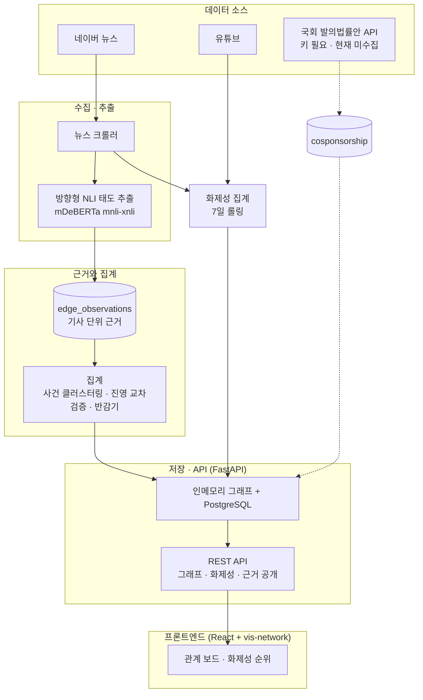

# SYNDEO: KOREA POLITICIAN
> **제22대 국회의원 관계망과 화제성을 뉴스에서 자동으로 추출하는 대시보드**

[English](README_EN.md) | [한국어](README.md)

**라이브**: https://korea-politician.vercel.app · **라이선스**: MIT

---

## 🌐 프로젝트 개요

제22대 국회의원 296명을 하나의 그래프로 보는 정치 인텔리전스 대시보드입니다. 누가 누구와 대립하고 협력하는지, 지금 누가 회자되는지를 한국어 뉴스에서 자동으로 뽑아 매일 갱신합니다.

- **관계망**: 의원 사이의 우호·갈등 관계를 뉴스 본문에서 추론해 그래프로 그립니다.
- **화제성**: 최근 7일간 뉴스 언급과 유튜브 조회수를 합산해 순위를 냅니다.
- **근거 공개**: 관계선을 누르면 그 관계가 어느 기사에서 나왔는지 원문 링크까지 볼 수 있습니다.

관계의 근거가 언론 보도이므로 보도의 편향을 함께 다룹니다([데이터 품질](#-데이터-품질) 참조).

---

## ✨ 주요 기능

### 1. 정치인 관계망 시각화


*의원 296명과 정당 8개를 물리 시뮬레이션 기반 그래프로 그립니다.*

- **관계 유형**: 우호(초록)·갈등(빨강)을 굵고 선명하게, 소속·언급은 배경으로 물립니다.
- **근거의 질이 선에 드러납니다**: 굵기는 교차 검증을 반영한 무게를 따르고, **한 진영에서만 보도된 관계는 점선**입니다. 화살표는 근거가 방향을 가리킬 때만 그립니다.
- **선을 짚으면 근거가 나옵니다**: 사건 수, 기사 수, 진영별 사건 수, 방향, 근거 종류(직접 인용/간접 인용/기자 서술), 신뢰도, 관측 기간, 근거 문장.
- **정당별 클러스터링**과 얼굴·이름 표시 전환, 한국어·영어 전환.

### 2. 화제성 순위


*최근 7일간 누가 회자되는지를 뉴스 언급과 유튜브 조회수로 집계합니다.*

- 뉴스 언급과 유튜브를 같은 척도(0~100)로 맞춰 합산합니다. 조회수는 로그 압축합니다.
- 여러 의원을 나열한 기사는 개인당 `1/√n` 로 나눠 담습니다.
- 화제성은 **7일 롤링**, 관계는 **누적**입니다. 두 창이 다르므로 화면에 각각 표시합니다.

### 3. 근거 기반 데이터 파이프라인
매일 04:00 KST 에 GitHub Actions 가 돕니다.

- **뉴스 수집**: 네이버 뉴스 정치·경제·사회 섹션과 의원별 검색.
- **관계 추출**: 방향형 Zero-Shot NLI 로 "누가 누구를 비판/지지했는가" 를 뽑습니다.
- **근거 적재**: 기사 단위 판정을 지우지 않고 전부 남깁니다. 엣지는 그 집계 결과입니다.
- **SNS 수집**: 유튜브. X·인스타그램은 비로그인 수집이 막혀 꺼 두었습니다.

---

## 📊 데이터 품질

관계의 근거가 언론 보도이므로, 보도의 선택 편향이 그대로 그래프에 들어올 수 있습니다. 정치커뮤니케이션·전산언어학 논문을 근거로 다음 보정을 넣었습니다.

| 보정 | 무엇을 하나 |
| :--- | :--- |
| **근거 로그** | 기사 하나의 판정 하나를 남기고, 관계는 그 전체를 집계해 정합니다. 기사 한 건이 관계를 결정하지 않습니다 |
| **발화 주체 귀속** | "A가 B를 비판했다" 를 방향형으로 판정하고, 정치인의 발언과 기자의 서술을 구분해 무게를 달리 줍니다 |
| **사건 단위 중복 제거** | 통신사 전재 여러 건을 한 사건으로 묶습니다. 편집 판단은 한 번이기 때문입니다 |
| **진영 교차 검증** | 진영이 다른 매체가 각자 보도했을 때만 신뢰도가 올라갑니다. 한 진영은 물량으로 신뢰를 살 수 없습니다 |
| **시간 감쇠** | 반감기 45일. 최근 논조와 누적 이력을 따로 보관합니다 |

화면에서는 신뢰도가 선에 드러납니다. 교차 검증이 안 된 관계는 점선이고 굵기도 절반입니다.

### 이 데이터의 한계

- **사람이 검증한 표본이 없습니다.** 정밀도·재현율 수치가 나오기 전까지 관계 데이터는 분석 결과가 아니라 예시로 보아야 합니다. 가장 큰 한계입니다.
- **관계는 보도된 관계입니다.** 언론이 다루지 않은 협력과 갈등은 여기에 없습니다. 뉴스 가치 연구가 예측하듯 갈등이 우호보다 훨씬 많이 잡힙니다.
- **화제성은 영향력이 아닙니다.** 보도량을 재는 값이라, 조용히 중요한 일을 하는 의원은 낮게 나옵니다.
- **수집원이 포털 한 곳입니다.** 언론사 진영은 통제하지만 포털의 편집 선택은 통제하지 못합니다.
- **남은 보정**: 언론사별 논조 기준선, 부정성 선택 편향 역가중, 클릭베이트 할인. 표본이 더 쌓여야 합니다.

> 근거 논문과 설계는 [MEDIA_BIAS_RESEARCH.md](docs/MEDIA_BIAS_RESEARCH.md), 적용 내역과 실측값은 [ALGORITHM_REPORT.md](docs/ALGORITHM_REPORT.md) 에 있습니다.

### 근거를 직접 확인하려면

**화면에서**: 관계선을 누르면 아래 패널에 사건 수, 진영별 사건 수, 신뢰도와 함께 근거 기사 목록이 원문 링크와 함께 펼쳐집니다.

**API 로** (인증 없는 읽기 전용):

```bash
# 관계 하나의 근거 전체 (집계 결과 + 기사 목록 + 사건 묶음)
curl "https://<백엔드>/api/relations/evidence?a=나경원&b=안철수"

# 근거 원본 덤프 (페이지 단위)
curl "https://<백엔드>/api/relations/evidence?limit=200"

# 언론사를 어느 진영으로 보고 있는지
curl "https://<백엔드>/api/relations/camps"
```

---

## 🏗️ 시스템 아키텍처



---

## 🛠️ 기술 스택

| 레이어 | 기술 스택 |
| :--- | :--- |
| **Frontend** | React 19, Vite 6, vis-network(2D 그래프), d3, zustand — 별도 저장소 |
| **Backend** | Python 3.12, FastAPI, psycopg 3, Playwright, BeautifulSoup |
| **관계 추출** | transformers, PyTorch, `MoritzLaurer/mDeBERTa-v3-base-mnli-xnli` (Zero-Shot NLI) |
| **Database** | PostgreSQL (관계형 + 그래프 저장) |
| **자동화 · 배포** | GitHub Actions(매일 수집), Render(API), Vercel(프론트), Docker Compose(로컬) |

> 프론트엔드는 vis-network 기반 **2D 물리 시뮬레이션 그래프**입니다. `docker-compose.yml` 의 Neo4j 서비스는 `legacy` 프로필로 남아 있으며 파이프라인이 쓰지 않습니다.

---

## 🚀 시작하기

### 사전 요구 사항
- Docker & Docker Compose (백엔드 · DB)
- Node.js 18+ (프론트엔드)
- Python 3.12 (파이프라인을 로컬에서 돌릴 때)

### 1. 백엔드와 DB

```bash
docker-compose up -d          # API :5000, PostgreSQL 호스트 :25432
```

- API 문서: http://localhost:5000/docs
- 최초 기동 시 `data/assembly_members_complete.json` 에서 의원 296명을 적재합니다.

### 2. 프론트엔드

별도 저장소입니다 → [showjihyun/frontend](https://github.com/showjihyun/frontend)

```bash
git clone https://github.com/showjihyun/frontend.git frontend
cd frontend && npm install && npm run dev   # http://localhost:3000
```

`VITE_API_BASE_URL` 을 비워 두면 개발 프록시가 `localhost:5000` 으로 넘깁니다.

### 3. 데이터 파이프라인 (선택)

수집은 GitHub Actions 가 매일 돌립니다. 로컬에서 직접 돌리려면 파이프라인을 **개별로** 실행하십시오. `scripts/run_news_sns.py` 는 `while True` 데몬이라 일회성 실행에 맞지 않습니다.

```bash
export PYTHONPATH=backend
export POSTGRES_HOST=localhost POSTGRES_PORT=25432 \
       POSTGRES_USER=postgres POSTGRES_PASSWORD=1234 POSTGRES_DB=postgres
export API_BASE_URL=http://localhost:5000 API_WRITE_TOKEN=<토큰>

python backend/crawlers/news_crawler_pipeline.py   # 뉴스 수집 + 관계 집계
python backend/crawlers/sns_crawler_pipeline.py    # 유튜브 화제성
```

> Windows PowerShell 에서는 `$env:PYTHONPATH="backend"` 형태로 지정합니다.
> 관계 추출 모델(약 550MB)을 처음 한 번 내려받습니다.

### 백엔드 배포
무료 티어(PostgreSQL + Render + GitHub Actions) 구성 가이드: [docs/BACKEND_DEPLOY.md](docs/BACKEND_DEPLOY.md)

---

## 🧪 테스트

```bash
pip install -r backend/requirements-api.txt -r backend/requirements-dev.txt
pytest
```

저장소 루트의 `pytest.ini` 가 경로와 `PYTHONPATH` 를 잡아 줍니다.

순수 함수(문장 분리, SimHash, 신뢰도, 진영 매핑, 공동발의 집계)는 DB 없이 돌고, 적재·집계·API 테스트는 실제 PostgreSQL 을 씁니다. 접속할 수 없으면 자동으로 건너뜁니다. 개발자의 데이터를 건드리지 않도록 전용 테스트 DB 를 따로 만듭니다.

---

## 🔧 운영

조율값은 전부 환경변수입니다. 기본값의 근거는 각 상수 옆에 적어 두었습니다.

| 환경변수 | 기본값 | 무엇을 바꾸나 |
| :--- | :--- | :--- |
| `RELATION_HALF_LIFE_DAYS` | 45 | 최근 논조의 반감기 |
| `RELATION_SIMHASH_DISTANCE` | 6 | 같은 사건으로 묶을 본문 유사도 |
| `RELATION_CAMP_RELIABILITY` | 0.7 | 진영 하나가 도달할 수 있는 신뢰 상한 |
| `RELATION_MIN_CLUSTERS` | 1 | 엣지로 승격하는 최소 사건 수 |
| `RELATION_NLI_THRESHOLD` | 0.65 | 함의 확률 하한 |
| `RELATION_DIRECTION_MARGIN` | 0.10 | 방향을 인정할 점수 차 |
| `RELATION_DROP_NARRATION` | 꺼짐 | 켜면 기자 서술을 엣지에서 아예 뺍니다 |

운영 스크립트:

```bash
# 근거 분포 확인 (사건 수, 진영 커버리지, 신뢰도, 전재 비율, 진영표 미등재 매체)
python backend/scripts/evidence_report.py

# 집계 이전에 만들어진 엣지를 근거 로그로 옮긴다. 먼저 계획만 본다.
python backend/scripts/backfill_edge_observations.py --dry-run
python backend/scripts/backfill_edge_observations.py --push

# 사람이 검증할 표본 뽑기 → 두 사람이 채운 뒤 채점
python backend/scripts/coding_sample.py sample -n 200
python backend/scripts/coding_sample.py score
```

---

## 🤝 기여 및 라이선스

방법론에 대한 비판을 환영합니다. 근거 엔드포인트가 열려 있으므로 추출 결과를 기사 단위로 직접 확인하고 반박할 수 있습니다.

- **라이선스**: MIT
- **데이터 출처**: 국회 공개 의원 정보, 네이버 뉴스, 유튜브

## 📚 관련 문서

| 문서 | 내용 |
| :--- | :--- |
| [MEDIA_BIAS_RESEARCH.md](docs/MEDIA_BIAS_RESEARCH.md) | 언론 편향 논문 조사(국제 Top 10 · 국내 12편)와 보정 알고리즘 설계 |
| [ALGORITHM_REPORT.md](docs/ALGORITHM_REPORT.md) | 적용 내역, 실측값, 파이프라인 변화 |
| [GRAPH_STRUCTURE.md](docs/GRAPH_STRUCTURE.md) | 노드·엣지 스키마와 근거 로그 테이블 |
| [reddit_post.md](docs/reddit_post.md) | r/politicalscience 에 올릴 방법론 설명 초안 |
| [DCP_paper.txt](docs/DCP_paper.txt) · [영문](docs/DCP_paper_en.txt) | 초기 설계 논문(Dynamic Contextual Propagation). **현재 파이프라인에서는 쓰지 않습니다.** 동맹을 "같은 정당" 으로 정의해 정파 구조를 보정이 아니라 증폭했고, 공동발의 기반으로 대체할 계획입니다 |

---
*Created by Choi Ji Hyun for Advanced Political Data Science Lab.*
