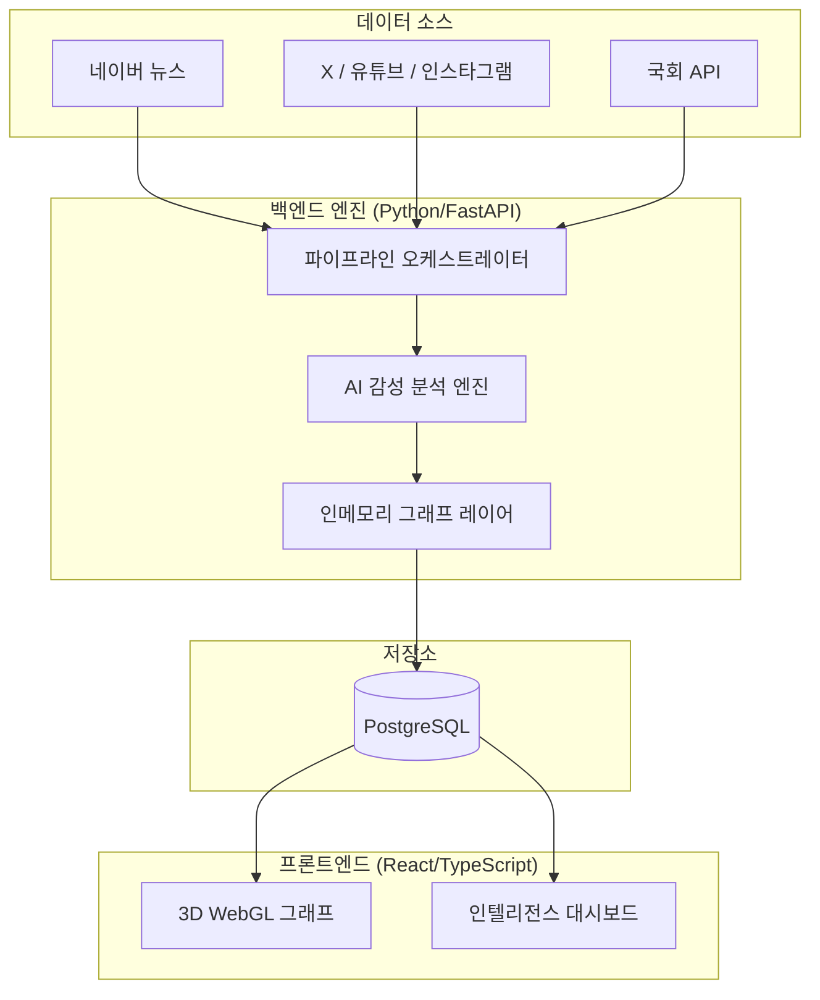

# SYNDEO: KOREA POLITICIAN
> **대한민국 국회의원 인공지능 인텔리전스 및 신경망 관계 분석 시스템**

[English](README_EN.md) | [한국어](README.md)

---

## 🌐 프로젝트 개요

SYNDEO는 대한민국 정치 지형의 복잡한 관계를 매핑하고 분석하기 위해 설계된 최첨단 정치 인텔리전스 플랫폼입니다. 3D 신경망 그래프 시각화와 뉴스 및 SNS 플랫폼 전반의 실시간 데이터 수집을 활용하여, SYNDEO는 정치적 영향력, 여론 및 상호작용 트렌드에 대한 전례 없는 인사이트를 제공합니다.

---

## ✨ 주요 기능

### 1. 3D 신경망 정치 관계도

*제22대 국회 의원 296명의 복잡한 관계망을 고속 3D 엔진(WebGL)으로 시각화합니다.*
- **다이내믹 인터랙션**: 수천 개의 정치적 관계를 회전, 확대, 축소하며 탐색할 수 있습니다.
- **감성 분석 매핑**: AI 감성 분석을 통해 의원 간의 긍정/부정적 관계를 시각적으로 인코딩합니다.
- **정당별 클러스터링**: 소속 정당(민주당, 국민의힘, 혁신당 등)에 따른 실시간 노드 그룹화.

### 2. 실시간 SNS 트렌드 및 화제성 분석

*X(트위터), 유튜브, 인스타그램 등 디지털 공간에서의 영향력을 실시간 모니터링합니다.*
- **화제성 스코어링**: 독자적인 알고리즘을 통한 실시간 화제성 및 사회적 영향력 점수 산출.
- **교차 언급 탐지**: 정치인들이 디지털 공간에서 서로를 언급하는 시점을 자동 추적.
- **참여도 분석**: 조회수, 좋아요, 댓글 등 정량적 지표의 실시간 트래킹.

### 3. 자율적 데이터 파이프라인
완전 자동화된 오케스트레이터를 통해 인텔리전스 데이터를 최신 상태로 유지합니다.
- **뉴스 크롤러**: 네이버 뉴스의 실시간 스크래핑 및 감성 분석 추출.
- **SNS 크롤러**: 디지털 언급 및 상호작용 패턴의 지속적 모니터링.
- **PostgreSQL 기반 지속성**: 구조화된 데이터와 그래프 관계의 견고한 저장소.

---

## 🏗️ 시스템 아키텍처



---

## 🛠️ 기술 스택

| 레이어 | 기술 스택 |
| :--- | :--- |
| **Frontend** | React 18, TypeScript, Vite, Tailwind CSS, Three.js, React Force Graph 3D |
| **Backend** | Python 3.12, FastAPI, Playwright, Psycopg2 |
| **Database** | PostgreSQL (Relational & Graph Storage) |
| **DevOps** | Docker, Docker Compose, Nginx |

---

## 🚀 시작하기

### 사전 요구 사항
- Docker & Docker Compose
- Node.js (로컬 프론트엔드 개발용)

### 빠른 시작
1. **리포지토리 클론**
2. **인프라 가동**
   ```bash
   docker-compose up -d
   ```
3. **데이터 파이프라인 실행**
   ```bash
   $env:PYTHONPATH="backend"ㅇ
   python backend/scripts/run_news_sns.py
   ```
4. **접속 주소**
   - 프론트엔드: `http://localhost:3100`
   - API 문서: `http://localhost:5000/docs`

---

## 🤝 기여 및 라이선스
본 프로젝트는 정치 데이터 인텔리전스 연구 이니셔티브의 일환입니다. 반박시 니말이
- **라이선스**: MIT
- **데이터 출처**: 국회 공식 데이터, 뉴스/SNS 오픈 API.

---
*Created by Choi Ji Hyun for Advanced Political Data Science Lab.*
