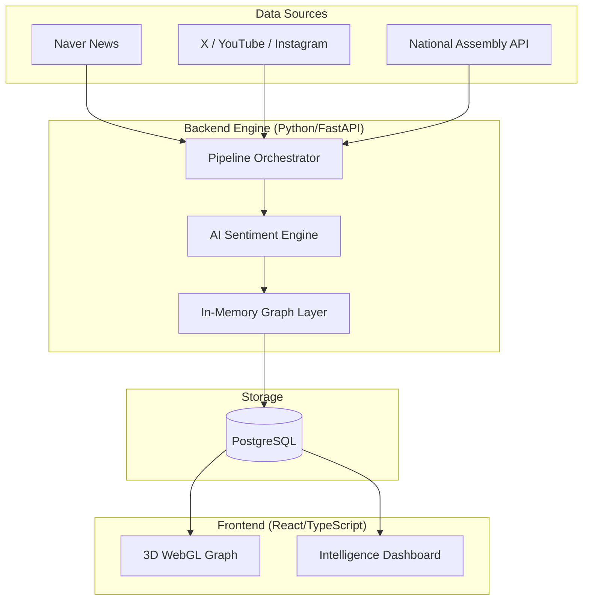

# SYNDEO: KOREA POLITICIAN
> **Advanced Neural Political Graph Analysis System**

[English](README_EN.md) | [한국어](README.md)

---

## 🌐 Project Overview

SYNDEO is a cutting-edge political intelligence platform designed to map and analyze the complex relationships within the Korean political landscape. By leveraging 3D neural graph visualization and real-time data collection across news and SNS platforms, SYNDEO provides unprecedented insights into political influence, sentiment, and interaction trends.

---

## ✨ Key Features

### 1. 3D Neural Political Graph

*Visualize the intricate web of all 296 members of the 22nd Assembly in a high-performance 3D space.*
- **Dynamic Interaction**: Rotate, zoom, and pan through thousands of political relations.
- **Sentiment Mapping**: Visual encoding of positive/negative relationships based on AI sentiment analysis.
- **Party Clustering**: Real-time clustering of nodes by political affiliation (DPK, PPP, NHR, etc.).

### 2. Real-time SNS Trends & Virality

*Monitor digital presence and influence across X (Twitter), YouTube, and Instagram.*
- **Virality Scoring**: Proprietary algorithm to calculate hotness and social impact scores.
- **Cross-Mention Detection**: Automated tracking of when politicians reference one another in digital spaces.
- **Engagement Analytics**: Real-time tracking of views, likes, and engagement metrics.

### 3. Autonomous Data Pipeline
A fully automated orchestrator ensures the intelligence is never outdated.
- **News Crawler**: Real-time scraping of Naver News with affect-based sentiment extraction.
- **SNS Crawler**: Persistent monitoring of digital mentions and interaction patterns.
- **PostgreSQL Persistence**: Robust storage of structured data and graph-based relationships.

---

## 🏗️ System Architecture



---

## 🛠️ Tech Stack

| Layer | Technologies |
| :--- | :--- |
| **Frontend** | React 18, TypeScript, Vite, Tailwind CSS, Three.js, React Force Graph 3D |
| **Backend** | Python 3.12, FastAPI, Playwright, Psycopg2 |
| **Database** | PostgreSQL (Relational & Graph Storage) |
| **DevOps** | Docker, Docker Compose, Nginx |

---

## 🚀 Getting Started

### Prerequisites
- Docker & Docker Compose
- Node.js (for local frontend development)

### Quick Start
1. **Clone the repository**
2. **Launch the infrastructure**
   ```bash
   docker-compose up -d
   ```
3. **Run the data pipeline**
   ```bash
   $env:PYTHONPATH="backend"
   python backend/scripts/run_news_sns.py
   ```
4. **Access the platform**
   - Frontend: `http://localhost:3100`
   - API Docs: `http://localhost:5000/docs`

---

## 🤝 Contribution & License
This project is part of a political intelligence research initiative.
- **License**: MIT
- **Data Source**: Official National Assembly Data, News & SNS Open APIs.

## 📚 Publications

For a detailed technical dive into the **Dynamic Contextual Propagation (DCP)** algorithm and the hybrid architecture powering SYNDEO, please refer to our research papers:

- [Research Paper (English) - DCP_paper_en.txt](docs/DCP_paper_en.txt)
- [Research Paper (Korean) - DCP_paper.txt](docs/DCP_paper.txt)

---
*Created by Choi Ji Hyun for Advanced Political Data Science Lab.*
