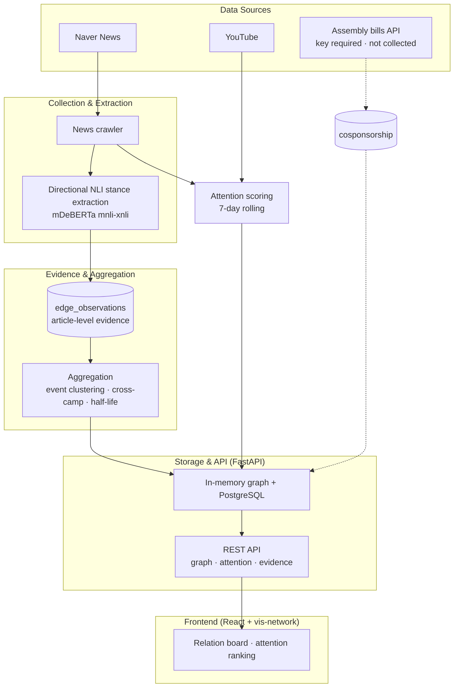

# SYNDEO: KOREA POLITICIAN
> **Inferring the relational map of South Korea's 22nd National Assembly from news text — and publishing the evidence behind it**

[English](README_EN.md) | [한국어](README.md)

**Live**: https://korea-politician.vercel.app · **License**: MIT

---

## 🌐 Project Overview

This project treats the 296 sitting members of South Korea's National Assembly as a graph and infers ally/conflict relations between them from Korean-language news, rather than from roll-call votes. Because the evidence is press coverage, **the slant of that coverage flows straight into the graph** — that is the central problem this project has to answer for.

So corrections are applied at every stage of relation inference, and **the evidence behind every edge is published**. For any relation you can inspect the source articles, the camp distribution of the outlets that reported it, and the cross-camp corroboration confidence.

- Literature review and algorithm design: [docs/MEDIA_BIAS_RESEARCH.md](docs/MEDIA_BIAS_RESEARCH.md) (Korean)
- What was applied, with measurements: [docs/ALGORITHM_REPORT.md](docs/ALGORITHM_REPORT.md) (Korean)
- Graph schema: [docs/GRAPH_STRUCTURE.md](docs/GRAPH_STRUCTURE.md) (Korean)

---

## ✨ Key Features

### 1. Legislator Relation Graph


*296 members and 8 parties in a force-directed graph.*

- **Relation types**: ally (green) and conflict (red) are drawn boldly; affiliation and co-mention recede into the background.
- **Evidence quality is visible in the line**: thickness follows the corroborated weight, and **relations reported by only one camp are dashed**. Arrows appear only when the evidence points one way.
- **Hover a line for its evidence**: event count, article count, per-camp event counts, direction, evidence type (direct quote / indirect quote / reporter narration), confidence, observation window, and the evidence sentence.
- **Party clustering**, face/name node display toggle, Korean/English UI.

### 2. Attention Ranking


*Who is being talked about over the last 7 days, from news mentions and YouTube views.*

- News and YouTube are normalized to the same 0–100 scale; view counts are log-compressed.
- An article naming many legislators contributes `1/√n` to each rather than a full count.
- Attention is a **7-day rolling window**; relations are **cumulative**. The two windows differ, so each panel labels its own.

### 3. Evidence-Based Data Pipeline
GitHub Actions runs daily at 04:00 KST.

- **News collection**: Naver News politics/economy/society sections plus per-member search.
- **Relation extraction**: directional zero-shot NLI answering "who criticized or supported whom".
- **Evidence log**: article-level judgements are never deleted. Edges are an aggregate over them.
- **SNS**: YouTube only. X and Instagram are disabled — logged-out scraping is blocked.

---

## 🔬 How Relations Are Derived

Building relations from press coverage inherits the press's selection bias. These corrections are applied; the supporting literature is in [docs/MEDIA_BIAS_RESEARCH.md](docs/MEDIA_BIAS_RESEARCH.md).

| Stage | What it does | Why |
| :--- | :--- | :--- |
| **Evidence log** | One article-level judgement is one row in `edge_observations`. Edges hold only the aggregate | Previously the last article about a pair silently overwrote all earlier ones, leaving no article count and no outlet |
| **Stance attribution** | Asks directional hypotheses ("A criticized B") and separates direct quote / indirect quote / reporter narration, weighting them differently | What a politician said and how a reporter framed it are different kinds of evidence |
| **Event de-duplication** | Wire copy is collapsed by body SimHash into a single vote | Syndication is one editorial decision republished across many URLs |
| **Cross-camp corroboration** | Confidence rises only when conservative, centre-wire and progressive outlets report independently; a single camp is capped | A conflict written up by one camp only may be an attack choice rather than an event |
| **Time decay** | 45-day half-life; recent tone and cumulative history are stored separately | Both relations and bias shift over time |

**Not yet done**: per-outlet tonality baselines, negativity inverse-probability weighting, clickbait discounting. All need more sample. The National Assembly co-sponsorship collector exists but its API requires a registration key that has not been obtained, so that table is empty.

**The biggest limitation**: there is **no human-validated sample** of the automatically extracted relations. Without precision and recall numbers, treat the relation data as illustration rather than as a result. Sampling and scoring tooling is ready (see Operations below).

### Inspecting the evidence yourself

```bash
# Everything behind one relation (aggregate + article list + event grouping)
curl "https://<backend>/api/relations/evidence?a=나경원&b=안철수"

# Raw evidence dump, paginated
curl "https://<backend>/api/relations/evidence?limit=200"

# Which camp each outlet is assigned to
curl "https://<backend>/api/relations/camps"
```

Read-only, no authentication. The camp mapping is a contestable judgement, so it is published rather than hidden.

---

## 🏗️ System Architecture



---

## 🛠️ Tech Stack

| Layer | Technologies |
| :--- | :--- |
| **Frontend** | React 19, Vite 6, vis-network (2D graph), d3, zustand — separate repository |
| **Backend** | Python 3.12, FastAPI, psycopg 3, Playwright, BeautifulSoup |
| **Relation extraction** | transformers, PyTorch, `MoritzLaurer/mDeBERTa-v3-base-mnli-xnli` (zero-shot NLI) |
| **Database** | PostgreSQL (relational + graph storage) |
| **Automation & Deploy** | GitHub Actions (daily crawl), Render (API), Vercel (frontend), Docker Compose (local) |

> The frontend is a **2D force-directed graph** built on vis-network. The Neo4j service in `docker-compose.yml` sits behind a `legacy` profile and is not used by the pipeline.

---

## 🚀 Getting Started

### Prerequisites
- Docker & Docker Compose (backend and database)
- Node.js 18+ (frontend)
- Python 3.12 (only if running the pipeline locally)

### 1. Backend and database

```bash
docker-compose up -d          # API on :5000, PostgreSQL on host :25432
```

- API docs: http://localhost:5000/docs
- On first start, 296 members are imported from `data/assembly_members_complete.json`.

### 2. Frontend

Lives in a separate repository → [showjihyun/frontend](https://github.com/showjihyun/frontend)

```bash
git clone https://github.com/showjihyun/frontend.git frontend
cd frontend && npm install && npm run dev   # http://localhost:3000
```

Leave `VITE_API_BASE_URL` empty and the dev proxy forwards to `localhost:5000`.

### 3. Data pipeline (optional)

GitHub Actions runs collection daily. To run it locally, invoke the pipelines **individually**. `scripts/run_news_sns.py` is a `while True` daemon and is not suited to one-off runs.

```bash
export PYTHONPATH=backend
export POSTGRES_HOST=localhost POSTGRES_PORT=25432 \
       POSTGRES_USER=postgres POSTGRES_PASSWORD=1234 POSTGRES_DB=postgres
export API_BASE_URL=http://localhost:5000 API_WRITE_TOKEN=<token>

python backend/crawlers/news_crawler_pipeline.py   # news + relation aggregation
python backend/crawlers/sns_crawler_pipeline.py    # YouTube attention
```

> On Windows PowerShell use `$env:PYTHONPATH="backend"`.
> The extraction model (~550MB) is downloaded once on first run.

### Backend deployment
Free-tier guide (PostgreSQL + Render + GitHub Actions): [docs/BACKEND_DEPLOY.md](docs/BACKEND_DEPLOY.md)

---

## 🧪 Tests

```bash
pip install -r backend/requirements-api.txt -r backend/requirements-dev.txt
pytest
```

The repository-root `pytest.ini` sets the test path and `PYTHONPATH` for you.

Pure functions (sentence splitting, SimHash, confidence, camp mapping, co-sponsorship counting) run without a database. Persistence, aggregation and API tests use a real PostgreSQL and skip automatically when none is reachable. A dedicated test database is created so your own data is never touched.

---

## 🔧 Operations

Every tuning value is an environment variable. The reasoning behind each default sits beside the constant in the source.

| Variable | Default | What it changes |
| :--- | :--- | :--- |
| `RELATION_HALF_LIFE_DAYS` | 45 | Half-life of the recent-tone weighting |
| `RELATION_SIMHASH_DISTANCE` | 6 | Body similarity for treating articles as one event |
| `RELATION_CAMP_RELIABILITY` | 0.7 | Confidence ceiling a single camp can reach |
| `RELATION_MIN_CLUSTERS` | 1 | Minimum events before a relation becomes an edge |
| `RELATION_NLI_THRESHOLD` | 0.65 | Entailment probability floor |
| `RELATION_DIRECTION_MARGIN` | 0.10 | Score gap required to claim a direction |
| `RELATION_DROP_NARRATION` | off | When on, reporter narration is excluded from edges entirely |

Operational scripts:

```bash
# Evidence distribution (events, camp coverage, confidence, syndication rate, unmapped outlets)
python backend/scripts/evidence_report.py

# Migrate pre-aggregation edges into the evidence log. Inspect the plan first.
python backend/scripts/backfill_edge_observations.py --dry-run
python backend/scripts/backfill_edge_observations.py --push

# Draw a sample for human coding, then score it after two coders fill it in
python backend/scripts/coding_sample.py sample -n 200
python backend/scripts/coding_sample.py score
```

---

## 📊 An Honest Account of the Data

- **These are reported relations.** Cooperation and conflict the press did not cover are absent. As news-values research predicts, conflict is captured far more often than alliance.
- **Attention is not influence.** It measures coverage volume, so a legislator doing consequential work quietly scores near zero.
- **One portal.** Outlet-level slant is controlled for; the portal's own editorial selection is not.
- **No human-validated sample yet.** Until precision and recall exist, the relation data is illustration.
- **Dashed means weak evidence** — reported by a single camp, or predating the aggregation layer and carrying no evidence record.

---

## 🤝 Contribution & License

Methodological criticism is welcome. The evidence endpoints are open, so the extraction can be checked article by article and argued with.

- **License**: MIT
- **Data sources**: public National Assembly member data, Naver News, YouTube

## 📚 Documentation

| Document | Contents |
| :--- | :--- |
| [MEDIA_BIAS_RESEARCH.md](docs/MEDIA_BIAS_RESEARCH.md) | Media-bias literature review (10 international, 12 Korean) and correction algorithm design |
| [ALGORITHM_REPORT.md](docs/ALGORITHM_REPORT.md) | What was applied, measurements, pipeline changes |
| [GRAPH_STRUCTURE.md](docs/GRAPH_STRUCTURE.md) | Node and edge schema, evidence log table |
| [reddit_post.md](docs/reddit_post.md) | Draft methodology write-up for r/politicalscience |
| [DCP_paper_en.txt](docs/DCP_paper_en.txt) · [Korean](docs/DCP_paper.txt) | Original design paper (Dynamic Contextual Propagation). **No longer used in the pipeline** — it defined allies as "same party", which amplified partisan structure rather than correcting for it; a co-sponsorship-based replacement is planned |

---
*Created by Choi Ji Hyun for Advanced Political Data Science Lab.*
