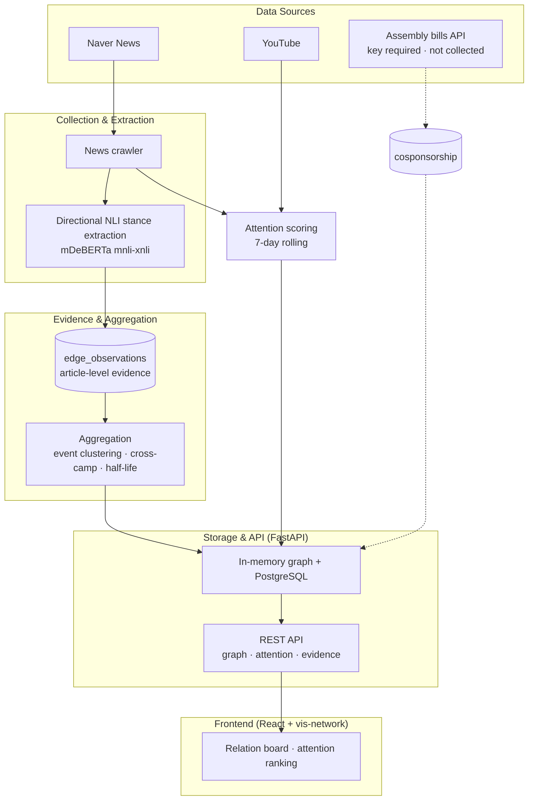

# SYNDEO: KOREA POLITICIAN
> **Inferring the relational map of South Korea's 22nd National Assembly from news text — and publishing the evidence behind it**

[English](README_EN.md) | [한국어](README.md)

**Live**: https://korea-politician.vercel.app · **License**: MIT

---

## 🌐 Project Overview

This project treats the 296 sitting members of South Korea's National Assembly as a graph and infers ally/conflict relations between them from Korean-language news, rather than from roll-call votes. Because the evidence is press coverage, **the slant of that coverage flows straight into the graph** — that is the central problem this project has to answer for.

So corrections are applied at every stage of relation inference, and **the evidence behind every edge is published**. For any relation you can inspect the source articles, the camp distribution of the outlets that reported it, and the cross-camp corroboration confidence.

- Literature review and algorithm design: [docs/MEDIA_BIAS_RESEARCH.md](docs/MEDIA_BIAS_RESEARCH.md) (Korean)
- What was applied, with measurements: [docs/ALGORITHM_REPORT.md](docs/ALGORITHM_REPORT.md) (Korean)
- Graph schema: [docs/GRAPH_STRUCTURE.md](docs/GRAPH_STRUCTURE.md) (Korean)

---

## ✨ Key Features

### 1. Legislator Relation Graph


*296 members and 8 parties in a force-directed graph.*

- **Relation types**: ally (green) and conflict (red) are drawn boldly; affiliation and co-mention recede into the background.
- **Evidence quality is visible in the line**: thickness follows the corroborated weight, and **relations reported by only one camp are dashed**. Arrows appear only when the evidence points one way.
- **Hover a line for its evidence**: event count, article count, per-camp event counts, direction, evidence type (direct quote / indirect quote / reporter narration), confidence, observation window, and the evidence sentence.
- **Party clustering**, face/name node display toggle, Korean/English UI.

### 2. Attention Ranking


*Who is being talked about over the last 7 days, from news mentions and YouTube views.*

- News and YouTube are normalized to the same 0–100 scale; view counts are log-compressed.
- An article naming many legislators contributes `1/√n` to each rather than a full count.
- Attention is a **7-day rolling window**; relations are **cumulative**. The two windows differ, so each panel labels its own.

### 3. Evidence-Based Data Pipeline
GitHub Actions runs daily at 04:00 KST.

- **News collection**: Naver News politics/economy/society sections plus per-member search.
- **Relation extraction**: directional zero-shot NLI answering "who criticized or supported whom".
- **Evidence log**: article-level judgements are never deleted. Edges are an aggregate over them.
- **SNS**: YouTube only. X and Instagram are disabled — logged-out scraping is blocked.

---

## 🔬 How Media Bias Is Corrected For

This project infers relations from **press coverage, not roll-call votes**, so the selection bias of that coverage flows straight into the graph. r/politicalscience put it bluntly: partisan reporting and clickbait make the data hard to trust. In answer, the correction stages below were designed from the political-communication and NLP literature.

The review and design live in [docs/MEDIA_BIAS_RESEARCH.md](docs/MEDIA_BIAS_RESEARCH.md); the applied result and measurements in [docs/ALGORITHM_REPORT.md](docs/ALGORITHM_REPORT.md). Both are in Korean.

### Which bias, and what stops it

| Bias | How it showed up here | Correction | Grounding |
| :--- | :--- | :--- | :--- |
| **Evidence lost to overwriting** | The last article about a pair erased all earlier ones — no article count, no outlet, no history | **Evidence log**: one article-level judgement per row; edges carry only the aggregate | — |
| **Tonality bias** | Without knowing which camp reported it, outlet slant could not be subtracted | Every observation stores its **outlet and camp** | Eberl et al. 2017, Choi & Im 2021 |
| **Gatekeeping / attack selection** | A conflict written up by a single camp was drawn as settled fact | **Cross-camp corroboration**: confidence rises only on independent reporting from different camps, and one camp is capped at 0.7 | Mullainathan & Shleifer 2005, Gentzkow & Shapiro 2006, Budak et al. 2016, Park 2024 |
| **Volume illusion from syndication** | Wire copy arrived under many URLs and each counted as a separate vote | **Event de-duplication** by body SimHash; a cluster spanning camps folds to centre, since that was the wire's decision | Yonhap's share of portal volume |
| **Framing / statement selection** | A reporter's adversarial framing weighed the same as what a politician actually said | **Stance attribution**: directional hypotheses, weighted direct quote 1.0 / indirect 0.7 / reporter narration 0.3, halved when hedged | Entman 1993, Recasens et al. 2013, Yu & Oh 2012 |
| **Sensational sentence over-represented** | One peak score stood in for the whole article | Weighted mean of the **top three windows** | — |
| **Roundup dilution** | A pair pulled from an article naming ten legislators weighed as much as a dedicated story | Divided by **1/√n** per person | — |
| **Dynamic bias** | Bias and relations shift over time, but only a cumulative value existed | **45-day half-life**; recent tone and cumulative history stored separately | Kim, Lelkes & McCrain 2022, Lee 2024 |
| **Unsourced data mixed in** | Five hand-written sample relations were indistinguishable from real observations, on a different scale (0–100 vs 0–1) | **Generation stopped**; existing rows are listed by the audit script | — |

### What the corrections actually changed

Measured during the work on hand-written test articles. These are diagnostics that changed the design, **not benchmark results**.

**The symmetric hypothesis was discarding real conflicts.** "A and B are in a hostile relationship" asserts a *mutual* state that one-sided criticism does not entail.

| Premise: "Rep. Na criticized Rep. Lee" | Entailment |
| :--- | ---: |
| Original symmetric hypothesis | 0.607 ← below the 0.65 threshold, **discarded** |
| Directional "Na criticized Lee" | 0.956 |
| Reverse "Lee criticized Na" | 0.093 |

**Co-mention was being read as a relation.** On one article naming five legislators:

| Rule | Relations produced | False positives |
| :--- | ---: | ---: |
| Both names anywhere in the window | 10 | 6 |
| Same sentence required when three or more are present | 4 | 0 |

**Syndication cannot buy corroboration.**

| Evidence | Events | Camp coverage | Confidence |
| :--- | ---: | ---: | ---: |
| Three copies of one wire story (Yonhap, Chosun, Hankyoreh) | 1 | 1/3 | 0.35 |
| Plus one independently reported story (Kyunghyang) | 2 | 2/3 | 0.58 |

**One camp cannot buy confidence with volume.** Twelve conservative stories reach 0.70 (the cap); three conservative plus three progressive reach 0.85.

### Not corrected yet

- **Per-outlet tonality baselines**: a conservative paper criticizing an opposition legislator carries different information than a progressive one doing the same. Subtracting that needs dozens of articles per outlet×party cell, which does not exist yet.
- **Negativity inverse-probability weighting**: cooperation goes unreported, so alliance edges are structurally scarce. Bill co-sponsorship would supply non-news evidence, but its API key was not obtained.
- **Clickbait discounting**: only the roundup weighting is in; the headline/body consistency classifier is not.
- **Source diversification**: outlet slant is controlled for, but one portal's editorial selection is not.

**The biggest limitation**: there is **no human-validated sample** of the automatically extracted relations. Without precision and recall, treat the relation data as illustration rather than a result. Stratified sampling and Krippendorff's alpha scoring are ready (see Operations).

### Inspecting the evidence yourself

**In the UI**: click a relation line and the panel below opens its evidence — event count, per-camp counts, confidence, and **the source articles with links to the originals**. Where several syndicated copies were folded into one event, it says so.

**Via the API**:

```bash
# Everything behind one relation (aggregate + article list + event grouping)
curl "https://<backend>/api/relations/evidence?a=나경원&b=안철수"

# Raw evidence dump, paginated
curl "https://<backend>/api/relations/evidence?limit=200"

# Which camp each outlet is assigned to
curl "https://<backend>/api/relations/camps"
```

Read-only, no authentication. The camp mapping is a contestable judgement, so it is published rather than hidden.

---

## 🏗️ System Architecture



---

## 🛠️ Tech Stack

| Layer | Technologies |
| :--- | :--- |
| **Frontend** | React 19, Vite 6, vis-network (2D graph), d3, zustand — separate repository |
| **Backend** | Python 3.12, FastAPI, psycopg 3, Playwright, BeautifulSoup |
| **Relation extraction** | transformers, PyTorch, `MoritzLaurer/mDeBERTa-v3-base-mnli-xnli` (zero-shot NLI) |
| **Database** | PostgreSQL (relational + graph storage) |
| **Automation & Deploy** | GitHub Actions (daily crawl), Render (API), Vercel (frontend), Docker Compose (local) |

> The frontend is a **2D force-directed graph** built on vis-network. The Neo4j service in `docker-compose.yml` sits behind a `legacy` profile and is not used by the pipeline.

---

## 🚀 Getting Started

### Prerequisites
- Docker & Docker Compose (backend and database)
- Node.js 18+ (frontend)
- Python 3.12 (only if running the pipeline locally)

### 1. Backend and database

```bash
docker-compose up -d          # API on :5000, PostgreSQL on host :25432
```

- API docs: http://localhost:5000/docs
- On first start, 296 members are imported from `data/assembly_members_complete.json`.

### 2. Frontend

Lives in a separate repository → [showjihyun/frontend](https://github.com/showjihyun/frontend)

```bash
git clone https://github.com/showjihyun/frontend.git frontend
cd frontend && npm install && npm run dev   # http://localhost:3000
```

Leave `VITE_API_BASE_URL` empty and the dev proxy forwards to `localhost:5000`.

### 3. Data pipeline (optional)

GitHub Actions runs collection daily. To run it locally, invoke the pipelines **individually**. `scripts/run_news_sns.py` is a `while True` daemon and is not suited to one-off runs.

```bash
export PYTHONPATH=backend
export POSTGRES_HOST=localhost POSTGRES_PORT=25432 \
       POSTGRES_USER=postgres POSTGRES_PASSWORD=1234 POSTGRES_DB=postgres
export API_BASE_URL=http://localhost:5000 API_WRITE_TOKEN=<token>

python backend/crawlers/news_crawler_pipeline.py   # news + relation aggregation
python backend/crawlers/sns_crawler_pipeline.py    # YouTube attention
```

> On Windows PowerShell use `$env:PYTHONPATH="backend"`.
> The extraction model (~550MB) is downloaded once on first run.

### Backend deployment
Free-tier guide (PostgreSQL + Render + GitHub Actions): [docs/BACKEND_DEPLOY.md](docs/BACKEND_DEPLOY.md)

---

## 🧪 Tests

```bash
pip install -r backend/requirements-api.txt -r backend/requirements-dev.txt
pytest
```

The repository-root `pytest.ini` sets the test path and `PYTHONPATH` for you.

Pure functions (sentence splitting, SimHash, confidence, camp mapping, co-sponsorship counting) run without a database. Persistence, aggregation and API tests use a real PostgreSQL and skip automatically when none is reachable. A dedicated test database is created so your own data is never touched.

---

## 🔧 Operations

Every tuning value is an environment variable. The reasoning behind each default sits beside the constant in the source.

| Variable | Default | What it changes |
| :--- | :--- | :--- |
| `RELATION_HALF_LIFE_DAYS` | 45 | Half-life of the recent-tone weighting |
| `RELATION_SIMHASH_DISTANCE` | 6 | Body similarity for treating articles as one event |
| `RELATION_CAMP_RELIABILITY` | 0.7 | Confidence ceiling a single camp can reach |
| `RELATION_MIN_CLUSTERS` | 1 | Minimum events before a relation becomes an edge |
| `RELATION_NLI_THRESHOLD` | 0.65 | Entailment probability floor |
| `RELATION_DIRECTION_MARGIN` | 0.10 | Score gap required to claim a direction |
| `RELATION_DROP_NARRATION` | off | When on, reporter narration is excluded from edges entirely |

Operational scripts:

```bash
# Evidence distribution (events, camp coverage, confidence, syndication rate, unmapped outlets)
python backend/scripts/evidence_report.py

# Migrate pre-aggregation edges into the evidence log. Inspect the plan first.
python backend/scripts/backfill_edge_observations.py --dry-run
python backend/scripts/backfill_edge_observations.py --push

# Draw a sample for human coding, then score it after two coders fill it in
python backend/scripts/coding_sample.py sample -n 200
python backend/scripts/coding_sample.py score
```

---

## 📊 An Honest Account of the Data

- **These are reported relations.** Cooperation and conflict the press did not cover are absent. As news-values research predicts, conflict is captured far more often than alliance.
- **Attention is not influence.** It measures coverage volume, so a legislator doing consequential work quietly scores near zero.
- **One portal.** Outlet-level slant is controlled for; the portal's own editorial selection is not.
- **No human-validated sample yet.** Until precision and recall exist, the relation data is illustration.
- **Dashed means weak evidence** — reported by a single camp, or predating the aggregation layer and carrying no evidence record.

---

## 🤝 Contribution & License

Methodological criticism is welcome. The evidence endpoints are open, so the extraction can be checked article by article and argued with.

- **License**: MIT
- **Data sources**: public National Assembly member data, Naver News, YouTube

## 📚 Documentation

| Document | Contents |
| :--- | :--- |
| [MEDIA_BIAS_RESEARCH.md](docs/MEDIA_BIAS_RESEARCH.md) | Media-bias literature review (10 international, 12 Korean) and correction algorithm design |
| [ALGORITHM_REPORT.md](docs/ALGORITHM_REPORT.md) | What was applied, measurements, pipeline changes |
| [GRAPH_STRUCTURE.md](docs/GRAPH_STRUCTURE.md) | Node and edge schema, evidence log table |
| [reddit_post.md](docs/reddit_post.md) | Draft methodology write-up for r/politicalscience |
| [DCP_paper_en.txt](docs/DCP_paper_en.txt) · [Korean](docs/DCP_paper.txt) | Original design paper (Dynamic Contextual Propagation). **No longer used in the pipeline** — it defined allies as "same party", which amplified partisan structure rather than correcting for it; a co-sponsorship-based replacement is planned |

---
*Created by Choi Ji Hyun for Advanced Political Data Science Lab.*
